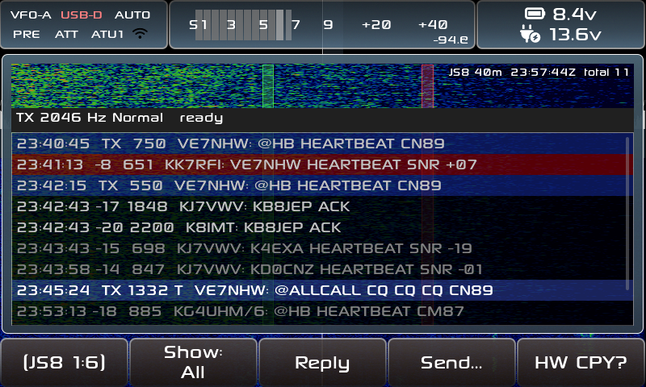
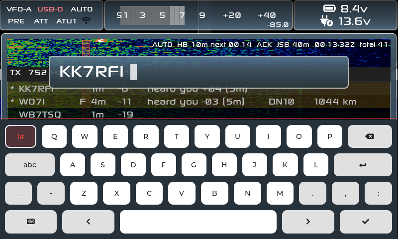
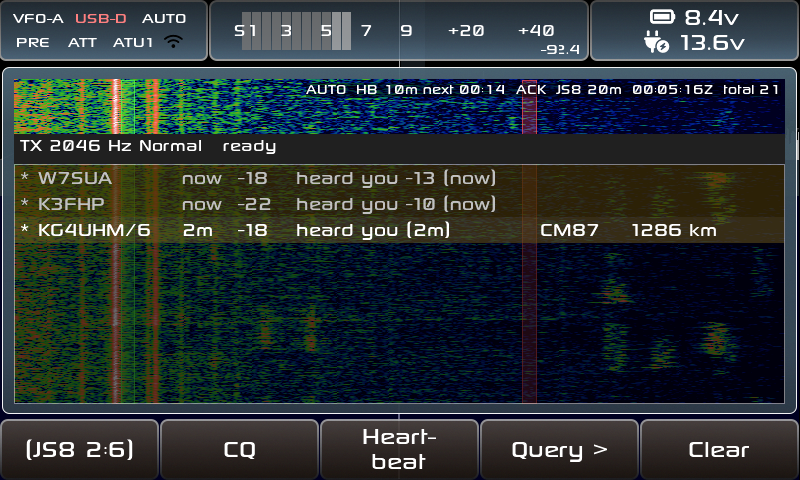
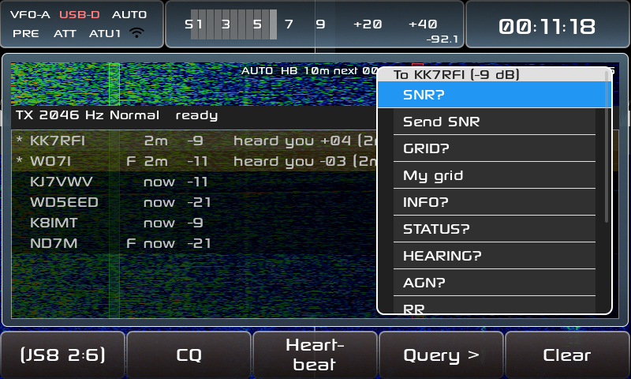
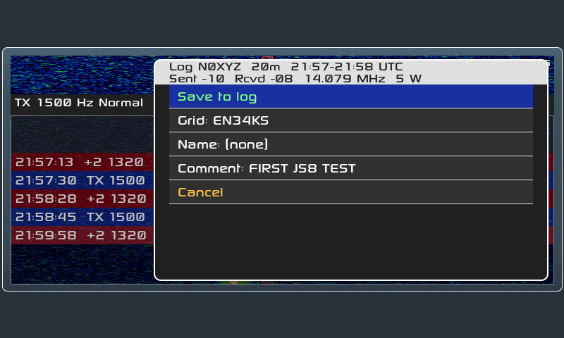
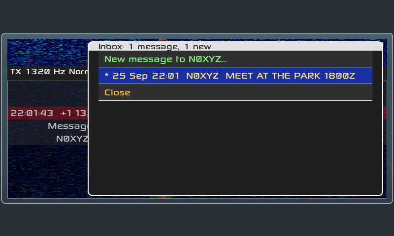
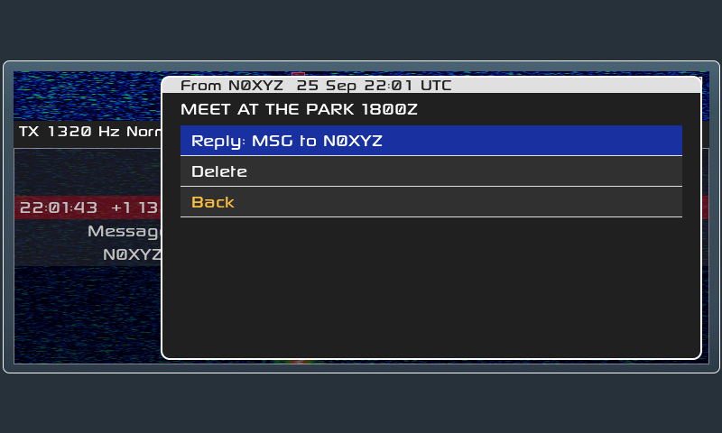
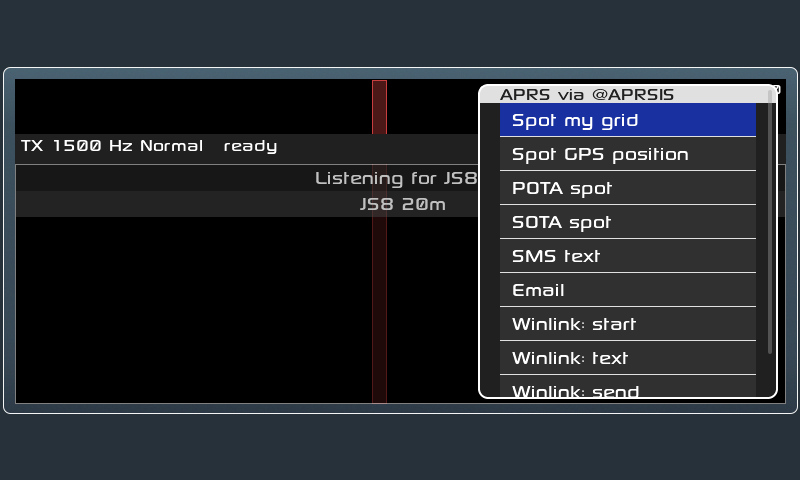

# X6100 JS8

**JS8 on the Xiegu X6100, running on the radio itself.** No PC, phone or
tablet: the decoder, keyboard, waterfall, logbook and inbox all live in
the radio's firmware, next to the FT8, RTTY, WeFax and NavTex apps.

> **Beta 1.** In daily use on the air: heartbeats acknowledged, queries
> answered, QSOs and messages with desktop JS8Call stations, all four
> speeds decoding. Please report what you find. Nothing transmits by itself
> when the app opens; automatic replies and heartbeats are switches you
> turn on.

*On the radio: our heartbeats (blue) acknowledged by KK7RFI (+07, red, to
us), other stations' traffic, and a CQ sent at Turbo speed (`T`).*

## Contents

- [What it does](#what-it-does)
- [Installing](#installing)
- [First steps](#first-steps)
- [The screen](#the-screen)
- [The buttons](#the-buttons)
- [Transmitting](#transmitting)
- [Speeds](#speeds)
- [Messages and the Inbox](#messages-and-the-inbox)
- [Logging](#logging)
- [Alerts](#alerts)
- [APRS](#aprs)
- [Files on the SD card](#files-on-the-sd-card)
- [Known issues in beta 1](#known-issues-in-beta-1)
- [Coming in beta 2](#coming-in-beta-2)
- [Bug reports and feature requests](#bug-reports-and-feature-requests)
- [Credits](#credits)
- [For developers](#for-developers)

## What it does

- **Receive and send JS8** as desktop JS8Call does: the same decoder, frame
  building, timing, commands and replies, so desktop users see nothing
  unusual.
- **All four speeds** (Normal, Fast, Turbo, Slow) decoded at once; send at
  any of them.
- **One-press messages:** CQ, heartbeat, HW CPY?, SNR?, GRID?, INFO?,
  STATUS?, HEARING?, AGN?, RR, 73.
- **Automatic replies, heartbeats and heartbeat acks**, each an opt-in
  switch, as on desktop.
- **Inbox** for `MSG` messages, sending messages, and **holding messages
  for other stations** (store and forward).
- **ADIF log** in desktop JS8Call's format, with a prompt when a QSO ends,
  and POTA/SOTA activation fields.
- **Alerts:** a beep for messages, CQs or new stations, and alert words
  (calls or words you choose) highlighted in purple.
- **APRS through JS8 gateways:** grid and GPS position spots, POTA and
  SOTA spots, SMS, email and Winlink.
- **Time Sync** from the decodes, and a Stations view of who is on and who
  heard you.

## Installing

1. Open [Releases](https://github.com/randal007/x6100-js8/releases) and
   download `sdcard.js8-beta1.img.zip` from the Assets.
2. Write it to a microSD card with [balenaEtcher](https://etcher.balena.io/)
   or Rufus (they unzip it for you). Any card of 1 GB or more works.
3. Put the card in the radio and switch on. The first start creates the
   card's **DATA** partition, where your settings and logs live.

**Updating from an earlier build:** writing a new image replaces the whole
card, DATA included. Copy the DATA partition's files to your PC first
(at least `params.db`, `qso_log.db`, the `.adi` logs and the `js8_*.txt`
files), write the new image, start the radio once, then copy them back.

**This is a complete firmware** (the R1CBU/1KO125 X6100 GUI with JS8
added), so everything else on the radio works as before. To go back, write
the image you used before.

## First steps

1. **Callsign and grid:** APP → Callsign, and APP → QTH (4 or 6
   characters). JS8 won't send without a callsign.
2. **Clock:** JS8 needs the radio's clock within about 2 seconds. WiFi sets
   it automatically; otherwise set it in SETTINGS, then use **Time Sync**
   (page 3) once some stations have decoded, which corrects it from their
   timing and saves it to the radio's clock chip.
3. **Open JS8:** APP → page 3 → **JS8**. The radio tunes the nearest JS8
   frequency; the **band keys** step through JS8Call's standard frequencies
   (160 m to 6 m), or GhostNet's, or you can type your own (**Freq**, page
   6). While JS8 is open the receive and transmit filters are 200–3000 Hz
   and power is capped at 5 W; all go back when you leave.
4. **Answer someone:** turn the **MFK** to select their row, then **HW
   CPY?** (page 2) for the usual reply to a CQ, **Reply** to type, or
   **Query >** (page 2) for the one-press messages.
5. **Stop sending:** **ESC** or press the **top knob**. The next ESC
   leaves the app.

## The screen

| Reply keyboard | Stations view |
|---|---|
|  |  |

**Waterfall** (top): the band, 200–3000 Hz. The **red band** is where you
transmit (turn the **main tuning knob** to move it); the **green line**
marks the selected station.

**Selecting a station:** turn the **MFK** onto one of their rows. They
stay selected while new messages arrive: their rows get a green bar at
the left, the TX bar says `selected: CALL`, and the green line follows
them if they move. Only another MFK move (or **Clear**, or a change of band or frequency)
changes it. The list keeps showing the newest lines; if you scroll up to
read, it goes back to following them 30 s after you last turned the MFK.

**Status line** (top right): what's switched on (`AUTO`, `HB 10m next
00:14`, `ACK`, `MSG 1 NEW`), the band, UTC time and how many messages
have been decoded.

**TX bar:** your offset and speed, then the countdown ("starts in 9 s
(1/3)"), the selected station and `auto CQ` when it's on. It turns red
while you're on the air.

**Typing** (Reply, Send…): the text box sits at the top of the screen and
the list stays in view, following the other station's message as it
grows, so you can type your answer while they're still sending. With the
on-screen keyboard the list moves up into the space above it. A USB
keyboard works too; lowercase is typed as capitals.

**The list** shows UTC time, SNR, audio offset, the speed if not Normal
(`F`, `T`, `S`) and the message:

| Row | Means |
|---|---|
| blue | sent by you |
| red | to you |
| green | a CQ |
| grey text | heartbeats |
| dark blue | to a group (`@ALLCALL`, `@HB`, ...) |
| purple | contains one of your [alert words](#alerts) |
| `[...]` | a low-confidence decode |
| ends in `...` | a long message still arriving; the row grows each decode cycle |

**Stations view** (page 3, *Show Stations*): one row per station, like
desktop's Call Activity. `*` and gold: they heard you (they replied or
acknowledged your heartbeat), with the report they gave you ("heard you
−13"). Then time since heard, their SNR here, speed, grid and distance.
Calls you've logged are green. Stations drop off after an hour.

**Grids** come from heartbeats, CQs and messages. Longer grids are kept to
6 characters, the most precise one wins, and the `RR73` sign-off is never
mistaken for a grid.

## The buttons

The first button on each row turns the page (`JS8 1:6` … `6:6`); hold it
to go back a page.

| Page | Button | Does |
|---|---|---|
| 1 | **Show: No HB / Directed / All** | Filter the list. *No HB* (the default): everything except heartbeats and SNR reports (mostly answers to heartbeats), unless they are to you. *Directed*: messages to you or to groups, plus everything on the selected station's frequency (in a long QSO the other side often drops your call). |
| 1 | **Reply** | Keyboard with the selected station's call filled in. If they asked you something with AUTO off, the answer is ready instead. |
| 1 | **Send…** | Keyboard, empty: `@ALLCALL …`, a call and a message, or free text. |
| 1 | **Clear** | Clear the list and this frequency's Stations list. |
| 2 | **CQ** | `CQ CQ CQ <grid>`. Switches heartbeats off (answers to a CQ start a QSO). **Hold for auto CQ**: one now, then one every minute (the button counts down) until someone answers you, you reply to someone, press CQ again, stop TX, change band or frequency, or leave it alone for an hour. |
| 2 | **Heartbeat** | One heartbeat now, at a free spot in the 500–1000 Hz heartbeat sub-band. |
| 2 | **Query >** | One-press messages to the selected station: SNR?, Send SNR, GRID?, My grid, INFO?, STATUS?, HEARING?, AGN?, RR, 73, Message…, Message via them…, Any messages? |
| 2 | **HW CPY?** | Sends `CALL HW CPY?` ("how do you copy?") to the selected station. |
| 3 | **Time Sync** | Set the clock from the last 2 minutes of decodes (needs 3 or more). |
| 3 | **Hold: Off / On** | Off: Reply and Query move your offset to the station's first. On: stay on your own offset. |
| 3 | **Show Stations / Messages** | Switch between the message list and the Stations view. Each frequency has its own Stations list: change band and back, and it's still there. All are emptied when JS8 opens. |
| 3 | **Inbox** | Your messages, and messages held for others. Shows *N new*. |
| 4 | **AUTO: Off / On** | Answer questions sent to you automatically (see [Transmitting](#transmitting)). |
| 4 | **HB: Off / N min** | Heartbeats every N minutes. When you switch it on, the main knob sets 5–30 min; press HB again to finish. Hold HB to change the interval. |
| 4 | **HB ACK** | Acknowledge others' heartbeats (needs AUTO and HB on, as on desktop). |
| 4 | **Texts…** | What AUTO sends for INFO? and STATUS?. |
| 5 | **APRS >** | [APRS](#aprs) spots and messages. |
| 5 | **Log QSO** | [Log](#logging) the QSO that just ended, or the selected station. |
| 5 | **Activ.: Off / POTA / SOTA** | Activating a park or summit: added to every log entry. Hold to type it. |
| 5 | **Log prompt: On / Off** | Offer to log when a QSO ends with 73 or SK. |
| 6 | **Alerts >** | [Alerts](#alerts): beeps and alert words. |
| 6 | **Speed** | The [speed](#speeds) you send at. Press to cycle; hold to match the selected station. |
| 6 | **Decode: All speeds / My speed** | Decode every speed (default), or only yours. |
| 6 | **Freq: JS8 / GhostNet / kHz** | Which frequencies the band keys step through: **JS8Call's** (7.078, 14.078 …) or **GhostNet's** (3.575, 7.107, 14.107 MHz), tuning the closest one. Or **Custom kHz…**: type a dial frequency (e.g. `7107.5`; the last one is filled in). The band keys go from a custom frequency back to the list. |

While a list is open (Query, Texts…, APRS, Log, Inbox, Alerts), any other
button just closes it; press again to do the thing. ESC closes lists too.

| Query list | Log popup |
|---|---|
|  |  |

## Transmitting

- **Offset:** the main tuning knob moves your TX offset (the red band),
  500 Hz up to where the signal would pass 3000 Hz. The dial frequency
  stays locked. With **Hold: Off**, replying moves your offset to theirs.
- **Power** is capped at 5 W while JS8 is open, as in the FT8 app. The
  level is learned and shared with FT8.
- **Stop:** ESC or the top knob, at any moment.
- **Nothing sends by itself** unless you switch it on. AUTO, HB and HB ACK
  are off every time the app opens, and the status line shows what's on:
  - **AUTO** answers SNR?, GRID?, INFO?, STATUS?, HEARING?, AGN?, message
    ACKs and message queries sent to your call. With AUTO off, each answer
    waits on **Reply** for you to send.
  - **HB** sends heartbeats on desktop's schedule; **HB ACK** acknowledges
    others' heartbeats.
  - A message to you turns HB and HB ACK off, so heartbeats don't cut into
    a QSO. After an hour without touching the radio, automatic sending
    pauses until you press something.

## Speeds

JS8 has four speeds (desktop JS8Call's figures):

| Speed | Slot | Width | Decodes down to | Marked |
|---|---|---|---|---|
| Normal | 15 s | 50 Hz | −24 dB | |
| Fast | 10 s | 80 Hz | −22 dB | `F` |
| Turbo | 6 s | 160 Hz | −20 dB | `T` |
| Slow | 30 s | 25 Hz | −28 dB | `S` |

- **Receiving:** all four at once, as desktop's multi-decoder does; the
  list and Stations view mark `F`, `T` and `S`. *Decode: My speed* (page 6)
  decodes only your speed.
- **Sending:** everything goes at the speed on page 6, automatic replies
  included. Replying to someone heard at another speed warns you; **hold
  Speed** to switch to theirs.
- **Heartbeats:** none in Turbo, as on desktop.

## Messages and the Inbox

| Inbox | Reading a message |
|---|---|
|  |  |

**Receiving:** a `MSG` sent to you goes to the Inbox (page 3). The status
line shows `MSG 1 NEW`. The sender expects an `ACK`: AUTO sends it, or
**Reply** has it ready.

**The Inbox** opens on the oldest unread message (`*`). Open one to read
it all; **Reply** writes back, **Delete** removes it. *New message to …*
writes to the selected station.

**Sending**, from the Query list with a station selected:

| Item | Sends | For |
|---|---|---|
| Message… | `N0XYZ MSG <text>` | their inbox |
| Message via them… | `N0XYZ MSG TO:W1ABC <text>` | N0XYZ holds it until W1ABC asks |
| Any messages? | `N0XYZ QUERY MSGS` | they answer `YES MSG ID 3` or `NO` |

When a station says it holds a message for you (`YES MSG ID 3`, or `MSG ID
3` on a heartbeat ack), **Reply** has `QUERY MSG 3` ready to fetch it.

**Holding messages for others:** a `MSG TO:W1ABC` sent to you is kept for
W1ABC (Inbox → *Held for others*) and ACKed. When W1ABC asks (`QUERY
MSGS`, then `QUERY MSG n`), it's sent as `W1ABC MSG <text> FROM <sender>`
and marked *(sent)*. With HB ACK on, W1ABC's heartbeat is acknowledged
with `MSG ID n` so they know. As always, AUTO sends these answers, or they
wait on Reply.

**HW CPY?** sent to you: **Reply** has your signal report ready.

## Logging

The Log popup (page 5 **Log QSO**, or by itself when a QSO ends with 73 or
SK) is filled in for you: call, band, start and end, reports, frequency,
power, their grid and yours (from GPS if one is plugged in). Add a name or
comment, then **Save to log**. Nothing is logged without Save.

- Saved to **`js8call_log.adi`** on the SD card's DATA partition, in desktop
  JS8Call's ADIF format (`MODE MFSK`, `SUBMODE JS8`), ready for your
  logger. FT8 keeps its own `ft_log.adi`.
- **Activating a park or summit:** page 5 *Activ.: POTA/SOTA* adds
  `MY_SIG`/`MY_SIG_INFO` or `MY_SOTA_REF` to every entry (hold the button
  to type the reference).
- Logged calls show green in the Stations view.

## Alerts

Page 6 **Alerts >**: a short beep for a message to you, an Inbox message,
a CQ or a new station (each a switch), and **alert words**: calls or
words you type (e.g. `VE7ABC @POTA SOTA`). Decodes containing them beep
twice and show purple, in the list and the Stations view. **Test beep**
plays it. Beeps never sound while transmitting.

## APRS

JS8Call stations with "spot to APRS" on forward `@APRSIS` messages to
APRS-IS. Page 5 **APRS >** builds them (as desktop JS8Call and KF7MIX's
JS8Spotter do):

| Item | Sends | You type |
|---|---|---|
| Spot my grid | `@APRSIS GRID CN89LH` | nothing |
| Spot GPS position | `@APRSIS GRID CN89KG12AB` | nothing (needs a GPS on the radio) |
| POTA spot | `@APRSIS CMD :APSPOT   :! POTA CA-1234 7.078 DATA JS8` | nothing: a [spot form](#pota-and-sota-spots) |
| SOTA spot | `@APRSIS CMD :APRS2SOTA:VE7/LM-001 7.078 DATA CALL JS8` | nothing: a [spot form](#pota-and-sota-spots) |
| SMS text | `@APRSIS CMD :SMS      :@6045551234 message` | number and message ([NA7Q's gateway](https://na7q.com/sms-gateway/), opt-in needed) |
| Email | `@APRSIS CMD :EMAIL-2  :address message` | address and message |
| Winlink: start / text / send | `SP address subject`, a line of text, `/EX` | [APRSLink](https://winlink.org/APRSLink)'s three steps |

Nothing reaches APRS unless a gateway station hears you; replies come back
over APRS, not JS8. APRS text is limited to 67 characters.

In beta 1 only **Spot my grid** has been confirmed on the air; the other
items follow desktop JS8Call's and JS8Spotter's formats but still need
testing through the gateways.

### POTA and SOTA spots

**POTA spot** and **SOTA spot** open a small form: **Send spot**, your
**Park** or **Summit**, the **Frequency**, **Mode** and a **Comment**.
The top line shows exactly what will be sent. Everything is remembered
for next time.

- **Frequency:** the JS8 dial you're on, or one you type (**Type a
  frequency…**, in kHz like `7185`, or MHz like `144.2` for VHF). Press
  **Frequency** to switch between the two. Use it to spot your SSB or CW
  run while JS8 carries the spot.
- **Mode:** press to step through DATA, SSB, CW, FM, AM and FT8 (POTA) or
  DV (SOTA). JS8 is DATA.
- **Comment:** optional. With none, a spot of the JS8 dial says `JS8`.

Where they go:

- **POTA → [APSPOT](https://apspot.radio/getting-started/)**, which posts
  the spot to **pota.app** if you have a pota.app account. Park numbers
  are `CA-1234` / `US-1234` now (not `VE-` / `K-`). A comment containing
  the word `TEST` is checked but not posted, handy for a first try.
- **SOTA → [APRS2SOTA](https://www.sotaspots.co.uk/Aprs2Sota_Info.php)**,
  which posts to SOTAwatch. You must register first: email its operator
  your name and callsign (see its page).

A JS8Call station with APRS spotting on has to hear you, and the
gateway's reply ("Spotted", or what went wrong) goes to your callsign on
APRS, not back over JS8. Check the spot on pota.app / SOTAwatch, or your
messages on [aprs.fi](https://aprs.fi) or findu.com. More in
[docs/SPOTS_PLAN.md](docs/SPOTS_PLAN.md).

## Files on the SD card

All on the **DATA** partition, readable on a PC:

| File | What |
|---|---|
| `js8call_log.adi` | your JS8 log (ADIF) |
| `js8_inbox.txt` | Inbox messages, one per line |
| `js8_held.txt` | messages held for other stations |
| `js8_texts.txt` | INFO, STATUS, last POTA/SOTA references, spot frequency/mode/comment, alert words |
| `params.db`, `qso_log.db` | the radio's settings and QSO database |
| `incoming_log.adi` | put an ADIF log here to import it (worked-before marks) at the next start |

## Known issues in beta 1

- **Type in capitals.** The keyboard's lowercase (`abc`) letters are
  ignored in messages.
- **ESC in any text box leaves the app** instead of just closing the
  box. Finish or clear what you typed rather than pressing ESC.
- **A USB keyboard drops letters** when you type fast, and **Enter in a
  Log QSO field logs the QSO** straight away: type the name etc. with the
  on-screen keyboard, or fill the fields before the last one.
- **The selected station can change by itself** when a new line arrives
  under it: check the green line before pressing Reply.
- **Test beep may be silent** on some radios (no freeze).
- The **waterfall** scrolls a little less smoothly than the main X6100
  waterfall.
- If the radio loses power while JS8 is open, the USB filter stays at
  200–3000 Hz (leaving the app normally puts yours back).

## Coming in beta 2

Done so far (after the first on-air QSOs):

- [x] ESC closes only the text box, not the app
- [x] USB keyboard: no lost letters; lowercase typed as capitals
- [x] Log QSO: Enter in a field only saves that field
- [x] The selected station stays selected (green bar, `selected:` in the TX bar)
- [x] The list follows new lines, and stays in view while you type a reply
- [x] CQ switches heartbeats off; hold CQ for auto CQ every minute
- [x] Hold the page button to go back a page
- [x] Show *No HB* also hides SNR reports
- [x] Clear on page 1, HW CPY? on page 2
- [x] Send up to 3000 Hz (the TX filter is set to 200–3000 Hz while JS8 is open)
- [x] Each frequency keeps its own Stations list (emptied when JS8 opens)
- [x] GhostNet frequencies and a custom frequency (**Freq**, page 6)
- [x] POTA and SOTA spots with the frequency and mode you choose (a spot
  form; POTA now goes through APSPOT, as POTAGW no longer answers)

Still to do:

- [ ] Test beep audible through the speaker
- [ ] A power loss with JS8 open no longer leaves the USB filter at
  200–3000 Hz
- [ ] Smoother waterfall
- [ ] Long messages tested on the air
- [ ] APRS tested on the air: POTA and SOTA spots, SMS, email and Winlink
  (so far only **Spot my grid** is confirmed working)

**Later (beta 2 or after):**

- [ ] Performance: profile the app and spread the work over the radio's
  four cores (the screen drawing and the JS8 decoder each lean on one core
  today)

## Bug reports and feature requests

This is a beta: reports from testing are very welcome.

- **Bugs and problems:** open an issue in
  [Issues](https://github.com/randal007/x6100-js8/issues). Please say which
  release you're running (e.g. `js8-beta1`), the band and speed, what you
  did, what you expected and what happened. A photo or screenshot of the
  radio's screen helps, and so does the `app_logs` folder from the SD card's
  DATA partition if the app closed or froze.
- **Feature requests and ideas:** start a thread in
  [Discussions](https://github.com/randal007/x6100-js8/discussions).

## Credits

| Layer | Project |
|---|---|
| Firmware GUI | [gdyuldin/x6100_gui](https://github.com/gdyuldin/x6100_gui) v0.34.2: R1CBU firmware by Oleg Belousov R1CBU, maintained by Georgy Dyuldin R2RFE |
| SWL additions | [TheMurusTeam/custom-r1cbu](https://github.com/TheMurusTeam/custom-r1cbu) 0.34.2 beta 6 by Hany El Imam 1KO125: WeFax, NavTex, channel list |
| JS8 engine | `core/` of [JS8Call-improved/Android-port](https://github.com/JS8Call-improved/Android-port), a C++ port of [JS8Call](https://github.com/js8call/js8call) by Jordan Sherer KN4CRD and contributors |

JS8 app by VE7NHW.

## For developers

- **Design notes:** [docs/RESEARCH.md](docs/RESEARCH.md) (JS8 vs FT8, why
  this engine), [docs/TX_PLAN.md](docs/TX_PLAN.md) (transmitting),
  [docs/T6_PLAN.md](docs/T6_PLAN.md) (speeds).
- **Code:** `src/js8/` (no LVGL, host-testable: receive, transmit, auto-reply,
  inbox, log, alerts), `src/dialog_js8.c` (the app), vendored engine in
  `third-party/js8core` with local patches listed in
  [UPSTREAM.md](third-party/js8core/UPSTREAM.md).
- **Tests:** `tests/test_js8.cpp` (Catch2; `[.slow]` runs real-time decodes),
  and [tools/js8_ui_harness](tools/js8_ui_harness), which runs the real app
  headless on stock LVGL under ASan/UBSan.
- **Building:** GitHub Actions builds the SD image on each pushed tag, using
  [AetherX6100Buildroot](https://github.com/gdyuldin/AetherX6100Buildroot);
  upstream notes in [docs/UPSTREAM_README.md](docs/UPSTREAM_README.md).

## License

The GUI is LGPL-2.1-or-later (`LICENSE`). The vendored js8core is GPLv3
(`third-party/js8core/LICENSE`), so the firmware image is distributed under
GPLv3.
