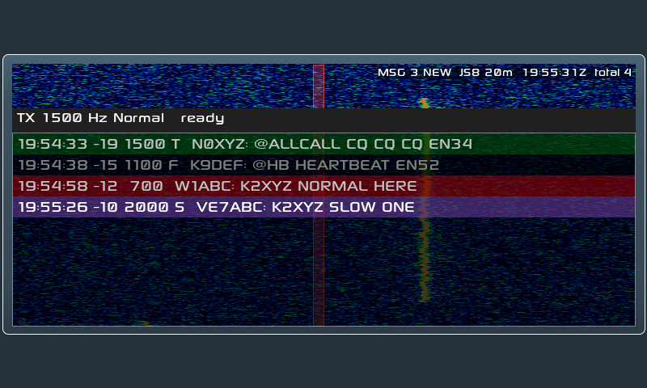
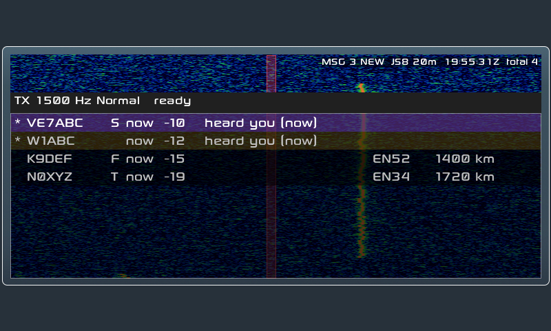
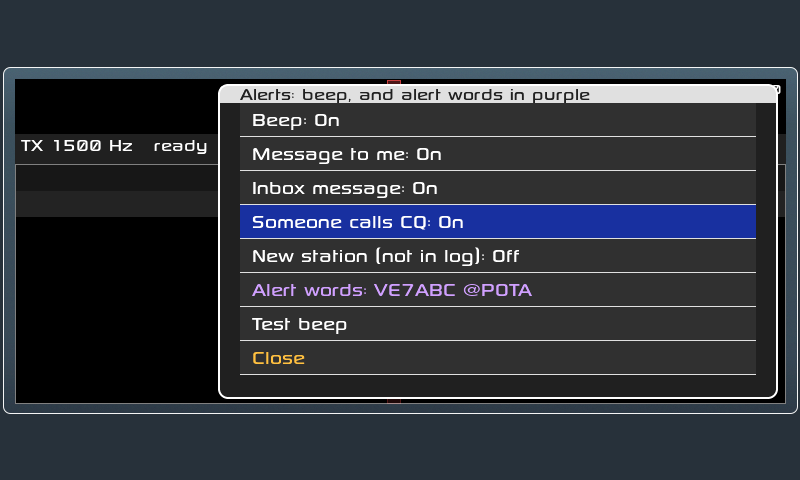
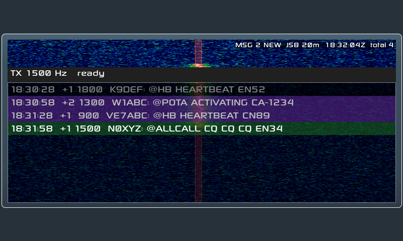
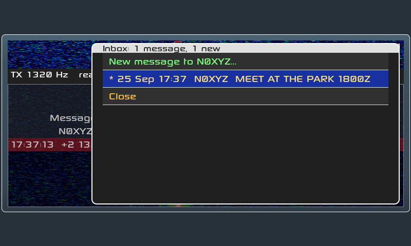
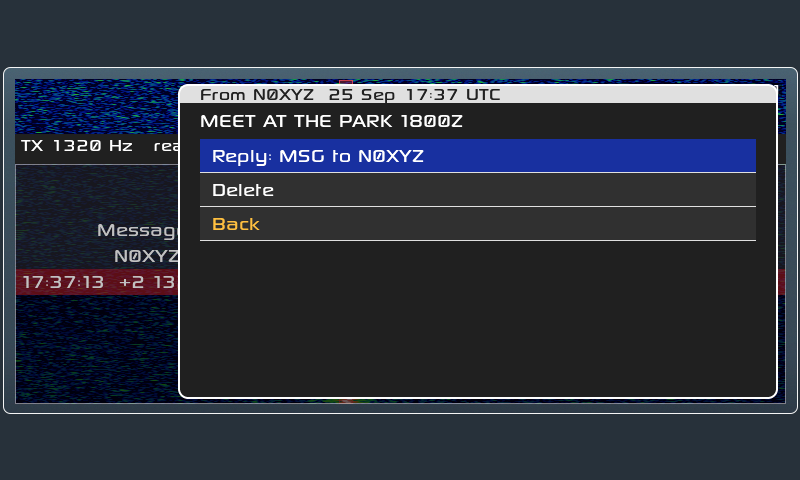

# X6100 JS8

Native [JS8](https://js8call.com) for the Xiegu X6100, running on the radio
itself with no PC, phone or tablet attached.

This is the X6100 LVGL firmware GUI with a JS8 app added alongside the
existing FT8, RTTY, WeFax and NavTex apps.

> **Status: receiving and transmitting on the air.** On 2026-09-24 the
> radio decoded live 40 m JS8 traffic, its first heartbeat was answered by
> KK6WVY (−23 dB), and an `INFO?` query to KN6OEH came back with their
> station details: a two-way exchange with desktop JS8Call users. Transmit
> into a dummy load first when you try a new build. Automatic replies and
> heartbeats are off every time the app opens.


*On a real X6100 (screen grabbed over the USB console): our heartbeat
acknowledged by N7EAL and KN6OEH, then an INFO? query answered by KN6OEH
("FT991A, EFRW, 30W, DM13, VER 2.2.1").*

### On the radio

| First heartbeat answered | Live 40 m traffic and the Query list |
|---|---|
|  |  |

## Using it

APP → page 3 → **JS8**. The radio tunes the nearest JS8 frequency (the band
keys step through JS8Call's standard dial frequencies) and starts decoding.
While the app is open the receive filter is 200–3000 Hz and the decoder
searches all of it (desktop searches its filter's edges), trying signals
near your TX offset first; your own filter comes back when you leave.

| Page | Button | Does |
|---|---|---|
| 1 | Show: No HB / Directed / All | Filter the list. *Directed* shows messages to your callsign (set in APP → Callsign) or to @groups, plus everything on the selected station's frequency (±10 Hz, the green line), since in a long QSO the other side often drops your call. |
| 1 | **Reply** | Opens the keyboard with the selected station's call filled in, e.g. `N0XYZ `. Type the rest (`SNR?`, `HELLO …`) and press Enter. |
| 1 | **Send…** | Opens the keyboard empty: `@ALLCALL …`, a call and a message, or free text (your call is added). |
| 1 | **Stop TX** | Unkeys at once and drops the rest of the message. ESC does the same; the next ESC closes the app. |
| 2 | **CQ** | Sends `CQ CQ CQ <grid>`. |
| 2 | **Heartbeat** | Sends one heartbeat (`CALL: HEARTBEAT FN42`) at a free spot in the 500–1000 Hz heartbeat sub-band. Your chat offset doesn't move. |
| 2 | **Query >** | One-press messages to the selected station: SNR?, Send SNR (how you hear them), GRID?, My grid, INFO?, STATUS?, HEARING?, AGN?, RR, 73, then **Message…**, **Message via them…** and **Any messages?** (see [Messages](#messages)). **Close** (last; one knob step back from the top) or Query > again closes it. |
| 2 | Clear | Clear the list, the station list and any half-received messages. |
| 3 | Time Sync | Correct the clock from the last 2 minutes of decodes (their median DT), like desktop JS8Call's drift tool, and save it to the radio's RTC. Needs 3+ decodes, so the clock must already be within a couple of seconds: set it roughly in SETTINGS first. |
| 3 | **Hold: Off/On** | Off (default): Reply and Query move your offset to the station's first. On: replies go out on your own offset. |
| 3 | **Show Stations / Messages** | Switch the list to one row per station, like desktop JS8Call's Call Activity. |
| 3 | **Inbox (N new)** | Messages sent to you with `MSG`: read, reply, delete, or write a new one. See [Messages](#messages). |
| 4 | **AUTO: Off/On** | Answer SNR?, GRID?, INFO?, STATUS?, HEARING? and AGN? sent to your call. Off (default): the answer is offered on Reply instead. |
| 4 | **HB: Off/N min** | Send heartbeats every N minutes. Switching it on lets the main knob set 5–30 min; press HB again (or wait 8 s) to finish, press once more to turn it off. Holding HB changes the interval without switching. |
| 4 | **HB ACK** | Answer others' heartbeats with how you hear them. Acts only while AUTO and HB are on, as on desktop. |
| 4 | **Texts…** | Edit what AUTO sends for INFO? and STATUS? (kept in `/mnt/js8_texts.txt`). |
| 5 | **APRS >** | APRS through JS8 gateways: grid spot, GPS position spot, POTA, SOTA, SMS, email, Winlink. See [APRS](#aprs). |
| 5 | **Log QSO** | Log the QSO that just ended, or the selected station, to `/mnt/js8call_log.adi`. See [Logging](#logging). |
| 5 | **Activ.: Off / POTA / SOTA** | Activating a park or summit: adds it to every log entry. Hold to type the reference. |
| 5 | **Log prompt: On/Off** | On (default): the Log popup opens by itself when a QSO ends with 73 or SK. |
| 6 | **Alerts >** | Beeps and alert words. See [Alerts](#alerts). |
| 6 | **Speed: Normal / Fast / Turbo / Slow** | The speed you send at. Press to cycle; hold to match the selected station. See [Speeds](#speeds). |
| 6 | **Decode: All speeds / My speed** | All (default): every speed is decoded at once, like desktop's multi-decoder. |

**Who heard you:** in the Stations view, stations that have heard you are
marked `*` and listed first. That covers anyone who acknowledged your
heartbeat or sent you a message. When they reported your signal (e.g. a
heartbeat ack `YOU HEARTBEAT SNR -08`) the view shows "heard you −08" and
how long ago. The other columns are time since last heard, their SNR here,
their grid and your distance to them. Stations drop off after an hour; a
band change clears the list. Calls you've logged show in green (see
[Logging](#logging)).

**Grids** are taken from heartbeats, CQs and messages: the word after
`GRID`, else any grid in the message. Longer grids (8 or 10 characters)
are cut to 6, a few km, which is what the list and the log keep. The most
precise one is kept (a later heartbeat's `DN17` doesn't replace `DN17AB`),
and the `RR73` sign-off is never mistaken for a grid.


**Transmitting:** the **main tuning knob** sets your TX offset (the red band
on the waterfall, 500–2450 Hz, remembered). The dial frequency stays
locked. The TX bar under the waterfall shows the offset and then the
countdown ("starts in 9 s (1/3)"). It turns red while keyed, and the
waterfall gets a red border. Sent messages appear in the list in blue.
Power is capped at 5 W, as in the FT8 app, and restored when you leave.


**Automatic replies and heartbeats** are off every time the app opens; switch
them on each on its own, like desktop JS8Call. The first automatic heartbeat
goes out one interval after HB is switched on (page 2's Heartbeat sends one now). A message to you (other than a heartbeat
ack) turns HB and HB ACK off again, so heartbeats don't cut into a QSO.
After an hour without touching the radio, automatic transmissions pause
until you press something. The status line always shows what's on.


Rows show UTC time, SNR, audio offset and the message. The MFK moves through
the list and marks the selected station's offset with a green line on the
waterfall. Tapping a row also shows its callsign and SNR. A multi-frame message shows
as it arrives: its row grows after each decode cycle, marked `...` until
the last frame completes it (as desktop's band activity does). One that
never finishes stays as it got after 60 s without a new frame; long
messages are no longer cut. Replies, the inbox, logging and alerts act only
on complete messages. Buffered commands such as `MSG` have their
checksum verified and removed, as in desktop JS8Call.

**Waterfall:** one row per 0.1 s of audio, drawn relative to the noise
floor so it works at any audio level. Audio arrives from the radio in
bursts, so rows are queued and drawn one at a time as each falls due by the
system clock, 10 a second. (LVGL's own timers run slow and caught up with
two-row jumps, which showed as a stutter.)


## Speeds

JS8 has four speeds; desktop JS8Call's numbers:

| Speed | Slot | Width | Decodes down to | Marked |
|---|---|---|---|---|
| Normal | 15 s | 50 Hz | −24 dB | (nothing) |
| Fast | 10 s | 80 Hz | −22 dB | `F` |
| Turbo | 6 s | 160 Hz | −20 dB | `T` |
| Slow | 30 s | 25 Hz | −28 dB | `S` |

- **Receiving:** every speed is decoded at the same time, so the list mixes
  them; rows and the Stations view show `F`, `T` or `S` for anything not
  Normal. **Decode: My speed** (page 6) decodes only the speed you send at,
  if the radio ever struggles with all four.
- **Sending:** everything you send, automatic replies included, goes at the
  speed on page 6, as on desktop; the TX bar shows it. Replying to a
  station last heard at another speed says so; **hold Speed** to switch to
  theirs (desktop's "Jump to … speed"). The red band on the waterfall is the
  speed's width, and the offset stops where the signal would pass 2500 Hz
  (Normal 2450, Fast 2420, Turbo 2340, Slow 2475 Hz).
- **Heartbeats:** none in Turbo, as on desktop (Heartbeat is refused, HB and
  HB ACK pause); changing speed restarts the HB interval.

| Every speed in one list | Stations with their speed |
|---|---|
|  |  |

## Alerts

Like desktop JS8Call's notifications and highlight words. Page 6's
**Alerts >** list:

| Item | Default | Beeps when |
|---|---|---|
| Beep | On | switches all beeps off or on |
| Message to me | On | a message to your call (not a heartbeat ack) |
| Inbox message | On | a `MSG` lands in the Inbox (two beeps) |
| Someone calls CQ | Off | a CQ is decoded |
| New station (not in log) | Off | a station is heard for the first time and isn't in your log |
| **Alert words** | none | a decode contains one of them (two beeps, row in purple) |

- **Alert words** are calls or words you type, separated by spaces, e.g.
  `VE7ABC @POTA SOTA`. They match whole words of a decode, as on desktop;
  a call also matches its other forms (`VE7ABC/P`). Matching rows are
  purple in the list and in the Stations view. Kept as `ALERTS=` in
  `/mnt/js8_texts.txt`, so they can be edited on a PC too.
- The beep is a short 1 kHz tone through the speaker, at most one alert
  every 3 s. It never sounds while transmitting (the speaker path carries
  the TX audio then). **Test beep** plays it. The beep plays in the
  background and stops at once if a transmission starts.
- Builds with commit 9496041 (the first with alerts) up to 35f3797 froze
  the screen on any beep, Test beep included; turn **Beep** off on those
  builds. Fixed in b47b7b1.

| The Alerts list | An alert word and a call in purple |
|---|---|
|  |  |

## Messages

JS8's store-and-forward messages, as desktop JS8Call handles them.

**Receiving.** A `MSG` sent to your call (`N0XYZ: VE7NHW MSG MEET AT 1800Z`)
goes to the **Inbox** once its checksum checks out. The status line shows
`MSG 1 NEW` and page 3's button shows *Inbox / 1 new*. The sender expects
`N0XYZ ACK`: with AUTO on it goes out by itself, otherwise select them and
press **Reply**, which has it ready. A resend (they missed your ACK) gets
ACKed again but isn't saved twice.

**The Inbox** opens on the oldest unread message, marked `*`. Press a
message to read it all. **Reply** writes a `MSG` back to them, **Delete**
removes it, and **Back** or ESC returns to the list. **New message to …**
at the top writes to the selected station. Messages are kept in
`/mnt/js8_inbox.txt` on the SD card, one per line, readable on a PC; the
newest 200 are kept.

**Sending,** from the Query list with a station selected:

| Item | Sends | For |
|---|---|---|
| Message… | `N0XYZ MSG <your text>` | their inbox; they ACK it |
| Message via them… | `N0XYZ MSG TO:W1ABC <your text>` | they hold it until W1ABC asks for it |
| Any messages? | `N0XYZ QUERY MSGS` | they answer `YES MSG ID 3` or `NO` |

When a station says it holds a message for you (`YES MSG ID 3`, or `MSG ID
3` on a heartbeat ack), **Reply** has `N0XYZ QUERY MSG 3` ready to fetch
it; the message then arrives as a `MSG` for your inbox. With AUTO on, a
`QUERY MSGS` to you is answered `NO`: the radio doesn't hold messages for
other stations.

| The Inbox | Reading a message |
|---|---|
|  |  |

## Logging

Like desktop JS8Call's Log QSO, but filled in for you. The **Log** popup shows
the call, band, UTC start and end, reports, frequency and power. **Save to
log** writes the entry; Grid, Name and Comment open the keyboard; Cancel
logs nothing.

- **The file:** `/mnt/js8call_log.adi`, i.e. `js8call_log.adi` on the SD
  card's DATA partition, readable on a PC. It uses desktop JS8Call's ADIF
  fields (`MODE MFSK`, `SUBMODE JS8`, dial + offset as `FREQ`), so loggers
  that import desktop logs take it as is. FT8 keeps its own `ft_log.adi`.
- **When it asks:** after a two-way QSO (both sides sent something, heartbeat
  acks don't count) ends with `73` or `SK` either way. It asks once per QSO,
  and never logs by itself. With **Log prompt: Off**, or if you're typing,
  the list shows "QSO with … ended" and **Log QSO** picks it up.
- **What's filled in:** *Sent* is the report you gave them (`SNR -12`), else
  how you heard them; *Rcvd* is the report they gave you (an SNR or a
  heartbeat ack). Start is the first directed message either way; a QSO
  quiet for 30 minutes starts over. Their grid is the most precise one
  they sent you (anywhere in a message), else the Stations list's; yours
  is from a current GPS fix (6 characters), else APP → QTH. `TX_PWR` is
  the radio's power.
- **Late arrivals:** the popup usually opens on the first 73, often yours.
  When their last message (`RR73 GRID DN17AB`) comes in with it open, the
  new report and grid appear in place, where you are in the list stays put,
  and a grid you typed is kept.
- **Activations:** with **Activ.: POTA** each entry gets `MY_SIG POTA` and
  `MY_SIG_INFO` (your park), as POTA's log upload wants; **SOTA** adds
  `MY_SOTA_REF`. The reference is the one you last spotted via APRS, or hold
  the button to type it.
- **Worked before:** saved QSOs also go to the radio's QSO database, and the
  Stations view shows calls you've logged in green.

| The Log popup after a QSO | Stations: N0XYZ logged |
|---|---|
|  |  |

## APRS

Desktop JS8Call stations with "spot to APRS" enabled forward `@APRSIS`
messages to APRS-IS. Page 5's **APRS >** list builds them for you (formats
as desktop JS8Call and KF7MIX's [JS8Spotter](https://kf7mix.com/js8spotter.html)
send them); most open the keyboard with the fixed part filled in and the
cursor where you type.

| Item | Sends | You type |
|---|---|---|
| Spot my grid | `@APRSIS GRID CN89LH` | nothing (your grid from APP → QTH, up to 6 characters) |
| Spot GPS position | `@APRSIS GRID CN89KG12AB` | nothing: a 10-character grid (~20 × 35 m) from a GPS plugged into the radio (gpsd); says so if there's no current fix |
| POTA spot | `@APRSIS CMD :POTAGW   :CALL PARK 7078 JS8` | the park (remembered for next time) |
| SOTA spot | `@APRSIS CMD :APRS2SOTA:SUMMIT 7.078 DATA CALL` | the summit (remembered). Needs [APRS2SOTA registration](https://www.sotaspots.co.uk/Aprs2Sota_Info.php) |
| SMS text | `@APRSIS CMD :SMS      :@6045551234 message{NN}` | number and message. NA7Q's [SMS gateway](https://na7q.com/sms-gateway/): the number must be opted in |
| Email | `@APRSIS CMD :EMAIL-2  :address message{NN}` | address and message |
| Winlink: start / text / send | `@APRSIS CMD :WLNK-1   :SP address subject`, then a line of text, then `/EX` | [APRSLink](https://winlink.org/APRSLink)'s three steps; spot your grid first |

- The gateway turns your grid into a position (the square's centre), so
  no GPS is needed; 6 characters is good to a few km. It reports you as
  your plain callsign, no SSID (a JS8 `CALL/7` would become `CALL-7`).
- APRS allows 67 characters after the addressee; longer messages are
  refused before sending. SMS, email and Winlink get a message ID `{NN}`
  added, as JS8Spotter does.
- Nothing reaches APRS unless a gateway station hears you. Replies (SMS,
  APRSLink) come back over APRS, not JS8.
- With a GPS plugged into the radio, **Spot GPS position** sends a
  10-character grid; gateways accept grids of any length.
- While a list (Query, Texts…, APRS, Log, Inbox, Alerts) is open, the other bottom buttons only
  close it, so it can't be left behind; press again to do the thing.

| APRS list | POTA spot, typing the park |
|---|---|
|  |  |

## Lineage

| Layer | Project |
|-------|---------|
| Firmware GUI | [gdyuldin/x6100_gui](https://github.com/gdyuldin/x6100_gui) v0.34.2 (R1CBU firmware, originally by Oleg Belousov R1CBU, maintained by Georgy Dyuldin R2RFE) |
| SWL additions | [TheMurusTeam/custom-r1cbu](https://github.com/TheMurusTeam/custom-r1cbu) 0.34.2 beta 6 by Hany El Imam 1KO125: WeFax, NavTex, channel list, broadcast info |
| JS8 engine | `core/` from [JS8Call-improved/Android-port](https://github.com/JS8Call-improved/Android-port), a Qt-free C++ port of [JS8Call](https://github.com/js8call/js8call) by Jordan Sherer KN4CRD and contributors |

Git history keeps these layers apart. The upstream x6100_gui history is
intact up to tag `v0.34.2`. Commit `20c4b77` imports the 1KO125 source,
which is published only inside that project's release tarballs. Everything
after that commit is the JS8 work.

## How it fits together

```
radio audio 44.1 kHz ─► dsp.cpp ÷4 ─► 11025 Hz float ─► dialog_js8 audio_cb
                                                          │
                          src/js8 (no LVGL, host-testable)│
                          ┌───────────────────────────────▼──┐
                          │ resample 11025 → 12000 Hz        │
                          │ js8core engine: 60 s UTC ring,   │
                          │   slot scheduling, decode thread │
                          │ frame → text, multi-frame join   │
                          └──────────────┬───────────────────┘
                                         ▼
                        dialog_js8.c: waterfall + band activity
```

JS8 Normal uses the same waveform as FT8: 79 8-FSK symbols of 0.16 s at
6.25 Hz spacing, 15 s slots, and the same Costas sync. It differs in the
error-correcting code (LDPC 174,87 with CRC-12 instead of 174,91 with
CRC-14), in the absence of Gray coding, and in its message layer. See
[docs/RESEARCH.md](docs/RESEARCH.md) for the full comparison and for why
the Android port's core was chosen over porting desktop JS8Call.

## Roadmap

- [x] Research: firmware, JS8 protocol, existing ports
- [x] Vendor js8core with small documented patches ([UPSTREAM.md](third-party/js8core/UPSTREAM.md))
- [x] `src/js8` RX library + host tests (x86 with ASan/UBSan, and ARM under qemu)
- [x] JS8 app on APP 3:3: waterfall, message list, filters, test mode
- [x] JS8 band presets (DB migration 4)
- [x] Headless UI harness and test-audio generator
- [x] CI image build with JS8 dependencies (GitHub Actions, manual dispatch)
- [x] First boot on a radio: WAV test mode, then on-air RX (2026-09-24, 40 m)
- [x] Decode load on the Cortex-A7: ~0.5 s CPU per 15 s cycle, app ~15 % of the 4 cores
- [x] Transmit, manual: reply, directed messages, free text, CQ, stop ([plan](docs/TX_PLAN.md), phases T1–T2)
- [x] Transmit on air: heartbeat acked by KK6WVY, INFO? answered by KN6OEH (2026-09-24)
- [x] Heartbeat, query shortcuts, Hold offset, Stations view with "heard you" (T3)
- [x] Opt-in auto-reply, heartbeat interval, heartbeat acks, idle watchdog (T4)
- [x] Time Sync from decode DTs, APRS page (grid, POTA, SOTA, SMS, email, Winlink)
- [x] ADIF logging with a log prompt, POTA/SOTA activation fields (T5)
- [x] Inbox for MSG with ACKs, MSG / MSG TO: / QUERY MSGS from the Query list (T5)
- [x] Alerts: beeps for messages, CQ, new stations; typed alert words highlighted
- [ ] Hold messages for other stations (answer QUERY MSGS / QUERY MSG from a store)
- [x] GPS-fed grid for APRS spots
- [x] Waterfall paced by the system clock (no catch-up jumps)
- [x] Fast / Turbo / Slow: all speeds decoded together, send at any speed (T6, [plan](docs/T6_PLAN.md))

## Testing

| What | How |
|---|---|
| Library unit + end-to-end tests | `tests/test_js8.cpp` (Catch2): resampler image rejection, rendering and assembly of frames made by JS8Call's encoder, the Android port's assembly tests, checksums, clock realign and gap fill, auto-reply rules, QSO tracking and ADIF records, the inbox, alert words, and 11025 Hz audio → decoded message. `[.slow]` adds real-time WAV test mode. |
| The real UI on a PC | [tools/js8_ui_harness](tools/js8_ui_harness): the actual dialog on stock LVGL with a simulated busy band, in real time, under ASan/UBSan. |
| On the radio, without RF | [test-audio](test-audio) (the Test WAV button was removed once on-air receive worked; the library's WAV mode remains). |
| Radio compiler | Everything JS8 compiles cleanly with the image's GCC 12.3 (Cortex-A7, NEON) against Boost 1.80. |

## Building

The SD card image is built by GitHub Actions (`.github/workflows/main.yml`)
on each pushed tag, using
[AetherX6100Buildroot](https://github.com/gdyuldin/AetherX6100Buildroot).
Upstream build instructions are in
[docs/UPSTREAM_README.md](docs/UPSTREAM_README.md).

## License

The GUI is LGPL-2.1-or-later (`LICENSE`). The vendored js8core is GPLv3
(`third-party/js8core/LICENSE`), so a firmware image that includes it is
distributed under GPLv3.
