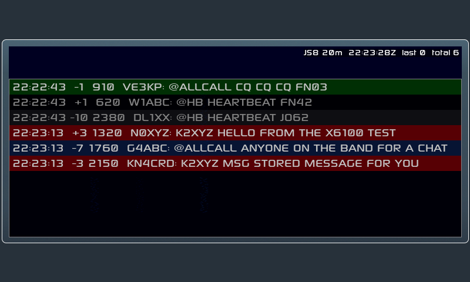

# X6100 JS8

Native [JS8](https://js8call.com) for the Xiegu X6100, running on the radio
itself with no PC, phone or tablet attached.

This is the X6100 LVGL firmware GUI with a JS8 app added alongside the
existing FT8, RTTY, WeFax and NavTex apps.

> **Status: receive-only, not yet tested on a radio.** The JS8 app decodes
> and displays JS8 Normal-mode traffic. Every part of it has been tested on
> a PC (see [Testing](#testing)) but none of it on real hardware or real
> signals yet. It never transmits.



*The real JS8 app code running headless on a PC with a simulated band:
a CQ (green), heartbeats (grey), messages to this station (red) and an
@ALLCALL message (blue). See [tools/js8_ui_harness](tools/js8_ui_harness).*

## Using it

APP → page 3 → **JS8**. The radio tunes the nearest JS8 frequency (the band
keys step through JS8Call's standard dial frequencies) and starts decoding.

| Button | Does |
|---|---|
| Show: No HB / Directed / All | Filter the list. *Directed* shows messages to your callsign (set in APP → Callsign) or to @groups. |
| Clear | Clear the list and any half-received messages. |
| Time Sync *(page 2)* | Snap the clock to the nearest 15 s. JS8 needs the clock within about ±1 s of UTC. |
| Test WAV *(page 2)* | Decode `/mnt/js8_test.wav` instead of the radio audio: see [test-audio](test-audio). |

Rows show UTC time, SNR, audio offset and the message. The MFK scrolls the
list; tap a row to mark its offset on the waterfall. Multi-frame messages appear
once their last frame arrives. Buffered commands such as `MSG` have their
checksum verified and removed, as in desktop JS8Call.

## Lineage

| Layer | Project |
|-------|---------|
| Firmware GUI | [gdyuldin/x6100_gui](https://github.com/gdyuldin/x6100_gui) v0.34.2 (R1CBU firmware, originally by Oleg Belousov R1CBU, maintained by Georgy Dyuldin R2RFE) |
| SWL additions | [TheMurusTeam/custom-r1cbu](https://github.com/TheMurusTeam/custom-r1cbu) 0.34.2 beta 6 by Hany El Imam 1KO125: WeFax, NavTex, channel list, broadcast info |
| JS8 engine | `core/` from [JS8Call-improved/Android-port](https://github.com/JS8Call-improved/Android-port), a Qt-free C++ port of [JS8Call](https://github.com/js8call/js8call) by Jordan Sherer KN4CRD and contributors |

Git history keeps these layers apart. The upstream x6100_gui history is
intact up to tag `v0.34.2`. Commit `20c4b77` imports the 1KO125 source,
which is published only inside that project's release tarballs. Everything
after that commit is the JS8 work.

## How it fits together

```
radio audio 44.1 kHz ─► dsp.cpp ÷4 ─► 11025 Hz float ─► dialog_js8 audio_cb
                                                          │
                          src/js8 (no LVGL, host-testable)│
                          ┌───────────────────────────────▼──┐
                          │ resample 11025 → 12000 Hz        │
                          │ js8core engine: 60 s UTC ring,   │
                          │   slot scheduling, decode thread │
                          │ frame → text, multi-frame join   │
                          └──────────────┬───────────────────┘
                                         ▼
                        dialog_js8.c: waterfall + band activity
```

JS8 Normal uses the same waveform as FT8: 79 8-FSK symbols of 0.16 s at
6.25 Hz spacing, 15 s slots, and the same Costas sync. It differs in the
error-correcting code (LDPC 174,87 with CRC-12 instead of 174,91 with
CRC-14), in the absence of Gray coding, and in its message layer. See
[docs/RESEARCH.md](docs/RESEARCH.md) for the full comparison and for why
the Android port's core was chosen over porting desktop JS8Call.

## Roadmap

- [x] Research: firmware, JS8 protocol, existing ports
- [x] Vendor js8core with small documented patches ([UPSTREAM.md](third-party/js8core/UPSTREAM.md))
- [x] `src/js8` RX library + host tests (x86 with ASan/UBSan, and ARM under qemu)
- [x] JS8 app on APP 3:3: waterfall, message list, filters, test mode
- [x] JS8 band presets (DB migration 4)
- [x] Headless UI harness and test-audio generator
- [ ] CI image build with JS8 dependencies (workflow updated; first build pending)
- [ ] First boot on a radio: WAV test mode, then on-air RX against desktop JS8Call
- [ ] Decode timing on the Cortex-A7 on a busy band
- [ ] Transmit: heartbeat, CQ, directed messages, free text
- [ ] Fast / Turbo / Slow submodes, auto-reply, logging

## Testing

| What | How |
|---|---|
| Library unit + end-to-end tests | `tests/test_js8.cpp` (Catch2): resampler image rejection, rendering and assembly of frames made by JS8Call's encoder, the Android port's assembly tests, checksums, clock realign, and 11025 Hz audio → decoded message. `[.slow]` adds real-time WAV test mode. |
| The real UI on a PC | [tools/js8_ui_harness](tools/js8_ui_harness): the actual dialog on stock LVGL with a simulated busy band, in real time, under ASan/UBSan. |
| On the radio, without RF | [test-audio](test-audio) and the Test WAV button. |
| Radio compiler | Everything JS8 compiles cleanly with the image's GCC 12.3 (Cortex-A7, NEON) against Boost 1.80. |

## Building

The SD card image is built by GitHub Actions (`.github/workflows/main.yml`)
on each pushed tag, using
[AetherX6100Buildroot](https://github.com/gdyuldin/AetherX6100Buildroot).
Upstream build instructions are in
[docs/UPSTREAM_README.md](docs/UPSTREAM_README.md).

## License

The GUI is LGPL-2.1-or-later (`LICENSE`). The vendored js8core is GPLv3
(`third-party/js8core/LICENSE`), so a firmware image that includes it is
distributed under GPLv3.
