# X6100 JS8

Native [JS8](https://js8call.com) for the Xiegu X6100, running on the radio
itself with no PC, phone or tablet attached.

This is the X6100 LVGL firmware GUI with a JS8 app added alongside the
existing FT8, RTTY, WeFax and NavTex apps.

> **Status: receiving and transmitting on the air.** On 2026-09-24 the
> radio decoded live 40 m JS8 traffic, its first heartbeat was answered by
> KK6WVY (−23 dB), and an `INFO?` query to KN6OEH came back with their
> station details: a two-way exchange with desktop JS8Call users. Transmit
> into a dummy load first when you try a new build. Automatic replies and
> heartbeats are off every time the app opens.

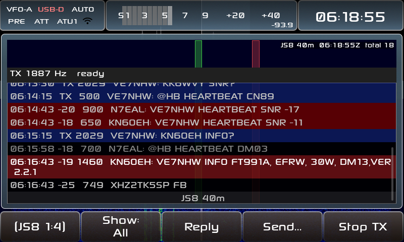

*On a real X6100 (screen grabbed over the USB console): our heartbeat
acknowledged by N7EAL and KN6OEH, then an INFO? query answered by KN6OEH
("FT991A, EFRW, 30W, DM13, VER 2.2.1").*

### On the radio

| First heartbeat answered | Live 40 m traffic and the Query list |
|---|---|
| 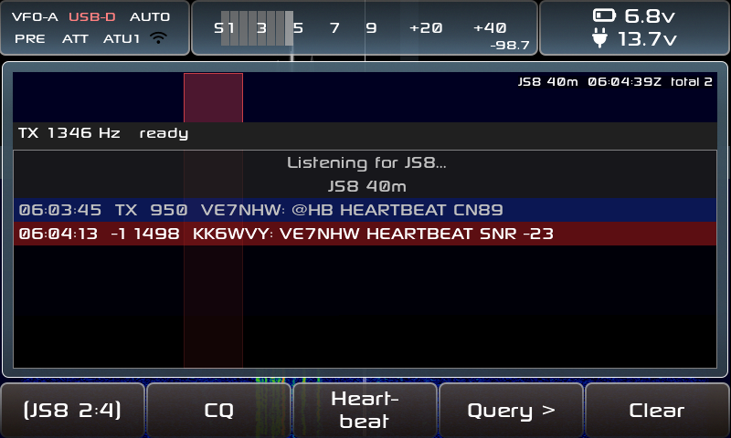 | 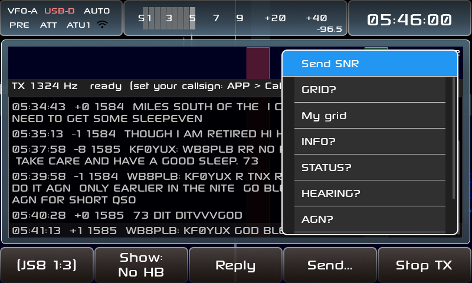 |

## Using it

APP → page 3 → **JS8**. The radio tunes the nearest JS8 frequency (the band
keys step through JS8Call's standard dial frequencies) and starts decoding.

| Page | Button | Does |
|---|---|---|
| 1 | Show: No HB / Directed / All | Filter the list. *Directed* shows messages to your callsign (set in APP → Callsign) or to @groups, plus everything on the selected station's frequency (±10 Hz, the green line), since in a long QSO the other side often drops your call. |
| 1 | **Reply** | Opens the keyboard with the selected station's call filled in, e.g. `N0XYZ `. Type the rest (`SNR?`, `HELLO …`) and press Enter. |
| 1 | **Send…** | Opens the keyboard empty: `@ALLCALL …`, a call and a message, or free text (your call is added). |
| 1 | **Stop TX** | Unkeys at once and drops the rest of the message. ESC does the same; the next ESC closes the app. |
| 2 | **CQ** | Sends `CQ CQ CQ <grid>`. |
| 2 | **Heartbeat** | Sends one heartbeat (`CALL: HEARTBEAT FN42`) at a free spot in the 500–1000 Hz heartbeat sub-band. Your chat offset doesn't move. |
| 2 | **Query >** | One-press messages to the selected station: SNR?, Send SNR (how you hear them), GRID?, My grid, INFO?, STATUS?, HEARING?, AGN?, RR, 73. **Close** (last; one knob step back from the top) or Query > again closes it. |
| 2 | Clear | Clear the list, the station list and any half-received messages. |
| 3 | Time Sync | Correct the clock from the last 2 minutes of decodes (their median DT), like desktop JS8Call's drift tool, and save it to the radio's RTC. Needs 3+ decodes, so the clock must already be within a couple of seconds: set it roughly in SETTINGS first. |
| 3 | **Hold: Off/On** | Off (default): Reply and Query move your offset to the station's first. On: replies go out on your own offset. |
| 3 | **Show Stations / Messages** | Switch the list to one row per station, like desktop JS8Call's Call Activity. |
| 4 | **AUTO: Off/On** | Answer SNR?, GRID?, INFO?, STATUS?, HEARING? and AGN? sent to your call. Off (default): the answer is offered on Reply instead. |
| 4 | **HB: Off/N min** | Send heartbeats every N minutes. Switching it on lets the main knob set 5–30 min; press HB again (or wait 8 s) to finish, press once more to turn it off. Holding HB changes the interval without switching. |
| 4 | **HB ACK** | Answer others' heartbeats with how you hear them. Acts only while AUTO and HB are on, as on desktop. |
| 4 | **Texts…** | Edit what AUTO sends for INFO? and STATUS? (kept in `/mnt/js8_texts.txt`). |
| 5 | **APRS >** | APRS through JS8 gateways: grid spot, GPS position spot, POTA, SOTA, SMS, email, Winlink. See [APRS](#aprs). |
| 5 | **Log QSO** | Log the QSO that just ended, or the selected station, to `/mnt/js8call_log.adi`. See [Logging](#logging). |
| 5 | **Activ.: Off / POTA / SOTA** | Activating a park or summit: adds it to every log entry. Hold to type the reference. |
| 5 | **Log prompt: On/Off** | On (default): the Log popup opens by itself when a QSO ends with 73 or SK. |

**Who heard you:** in the Stations view, stations that have heard you are
marked `*` and listed first. That covers anyone who acknowledged your
heartbeat or sent you a message. When they reported your signal (e.g. a
heartbeat ack `YOU HEARTBEAT SNR -08`) the view shows "heard you −08" and
how long ago. The other columns are time since last heard, their SNR here,
their grid and your distance to them. Stations drop off after an hour; a
band change clears the list.

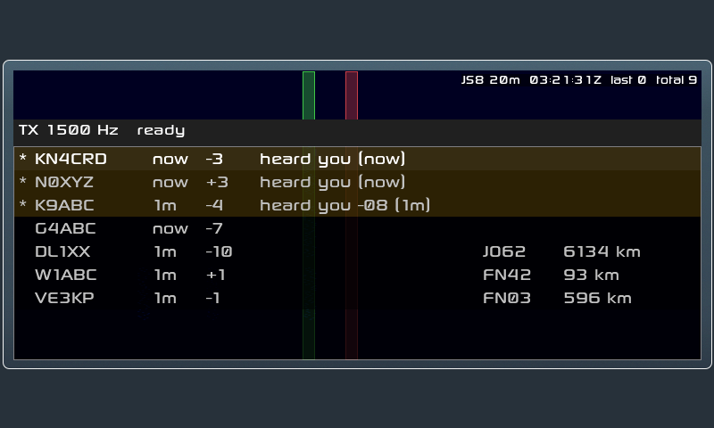

**Transmitting:** the **main tuning knob** sets your TX offset (the red band
on the waterfall, 500–2450 Hz, remembered). The dial frequency stays
locked. The TX bar under the waterfall shows the offset and then the
countdown ("starts in 9 s (1/3)"). It turns red while keyed, and the
waterfall gets a red border. Sent messages appear in the list in blue.
Power is capped at 5 W, as in the FT8 app, and restored when you leave.

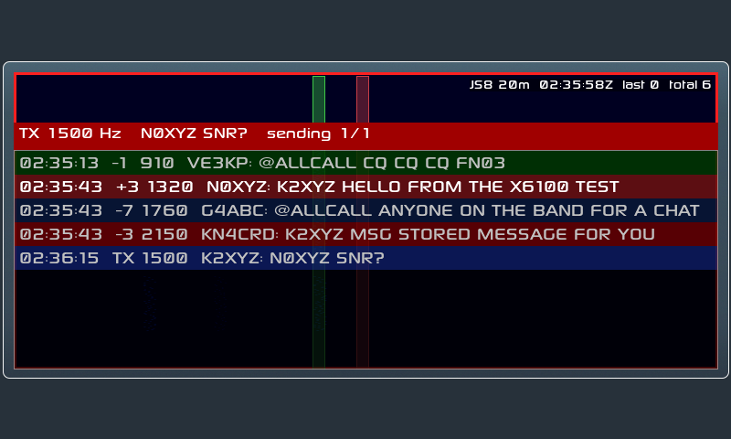

**Automatic replies and heartbeats** are off every time the app opens; switch
them on each on its own, like desktop JS8Call. The first automatic heartbeat
goes out one interval after HB is switched on (page 2's Heartbeat sends one now). A message to you (other than a heartbeat
ack) turns HB and HB ACK off again, so heartbeats don't cut into a QSO.
After an hour without touching the radio, automatic transmissions pause
until you press something. The status line always shows what's on.

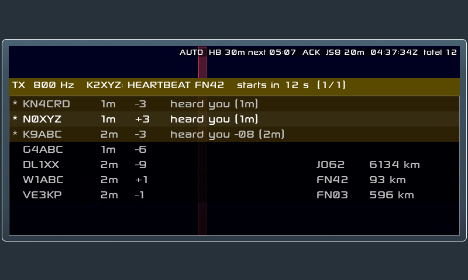

Rows show UTC time, SNR, audio offset and the message. The MFK moves through
the list and marks the selected station's offset with a green line on the
waterfall. Tapping a row also shows its callsign and SNR. Multi-frame messages appear
once their last frame arrives. Buffered commands such as `MSG` have their
checksum verified and removed, as in desktop JS8Call.

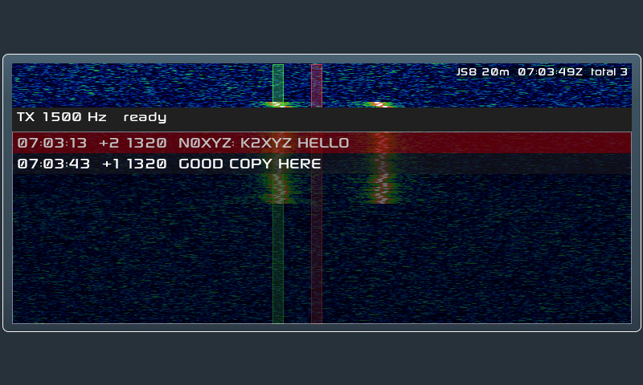

## Logging

Like desktop JS8Call's Log QSO, but filled in for you. The **Log** popup shows
the call, band, UTC start and end, reports, frequency and power. **Save to
log** writes the entry; Grid, Name and Comment open the keyboard; Cancel
logs nothing.

- **The file:** `/mnt/js8call_log.adi`, i.e. `js8call_log.adi` on the SD
  card's DATA partition, readable on a PC. It uses desktop JS8Call's ADIF
  fields (`MODE MFSK`, `SUBMODE JS8`, dial + offset as `FREQ`), so loggers
  that import desktop logs take it as is. FT8 keeps its own `ft_log.adi`.
- **When it asks:** after a two-way QSO (both sides sent something, heartbeat
  acks don't count) ends with `73` or `SK` either way. It asks once per QSO,
  and never logs by itself. With **Log prompt: Off**, or if you're typing,
  the list shows "QSO with … ended" and **Log QSO** picks it up.
- **What's filled in:** *Sent* is the report you gave them (`SNR -12`), else
  how you heard them; *Rcvd* is the report they gave you (an SNR or a
  heartbeat ack). Start is the first directed message either way; a QSO
  quiet for 30 minutes starts over. Their grid is from what they sent;
  yours is from a current GPS fix (6 characters), else APP → QTH. `TX_PWR`
  is the radio's power.
- **Activations:** with **Activ.: POTA** each entry gets `MY_SIG POTA` and
  `MY_SIG_INFO` (your park), as POTA's log upload wants; **SOTA** adds
  `MY_SOTA_REF`. The reference is the one you last spotted via APRS, or hold
  the button to type it.
- **Worked before:** saved QSOs also go to the radio's QSO database, and the
  Stations view shows calls you've logged in green.

| The Log popup after a QSO | Stations: N0XYZ logged |
|---|---|
| 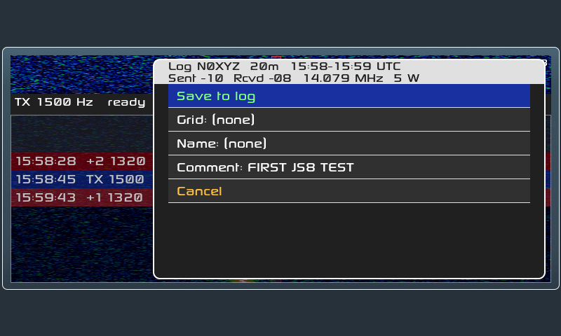 | 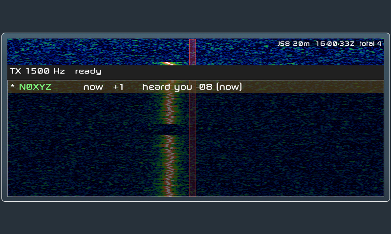 |

## APRS

Desktop JS8Call stations with "spot to APRS" enabled forward `@APRSIS`
messages to APRS-IS. Page 5's **APRS >** list builds them for you (formats
as desktop JS8Call and KF7MIX's [JS8Spotter](https://kf7mix.com/js8spotter.html)
send them); most open the keyboard with the fixed part filled in and the
cursor where you type.

| Item | Sends | You type |
|---|---|---|
| Spot my grid | `@APRSIS GRID CN89LH` | nothing (your grid from APP → QTH, up to 6 characters) |
| Spot GPS position | `@APRSIS GRID CN89KG12AB` | nothing: a 10-character grid (~20 × 35 m) from a GPS plugged into the radio (gpsd); says so if there's no current fix |
| POTA spot | `@APRSIS CMD :POTAGW   :CALL PARK 7078 JS8` | the park (remembered for next time) |
| SOTA spot | `@APRSIS CMD :APRS2SOTA:SUMMIT 7.078 DATA CALL` | the summit (remembered). Needs [APRS2SOTA registration](https://www.sotaspots.co.uk/Aprs2Sota_Info.php) |
| SMS text | `@APRSIS CMD :SMS      :@6045551234 message{NN}` | number and message. NA7Q's [SMS gateway](https://na7q.com/sms-gateway/): the number must be opted in |
| Email | `@APRSIS CMD :EMAIL-2  :address message{NN}` | address and message |
| Winlink: start / text / send | `@APRSIS CMD :WLNK-1   :SP address subject`, then a line of text, then `/EX` | [APRSLink](https://winlink.org/APRSLink)'s three steps; spot your grid first |

- The gateway turns your grid into a position (the square's centre), so
  no GPS is needed; 6 characters is good to a few km. It reports you as
  your plain callsign, no SSID (a JS8 `CALL/7` would become `CALL-7`).
- APRS allows 67 characters after the addressee; longer messages are
  refused before sending. SMS, email and Winlink get a message ID `{NN}`
  added, as JS8Spotter does.
- Nothing reaches APRS unless a gateway station hears you. Replies (SMS,
  APRSLink) come back over APRS, not JS8.
- With a GPS plugged into the radio, **Spot GPS position** sends a
  10-character grid; gateways accept grids of any length.
- While a list (Query, Texts…, APRS, Log) is open, the other bottom buttons only
  close it, so it can't be left behind; press again to do the thing.

| APRS list | POTA spot, typing the park |
|---|---|
| 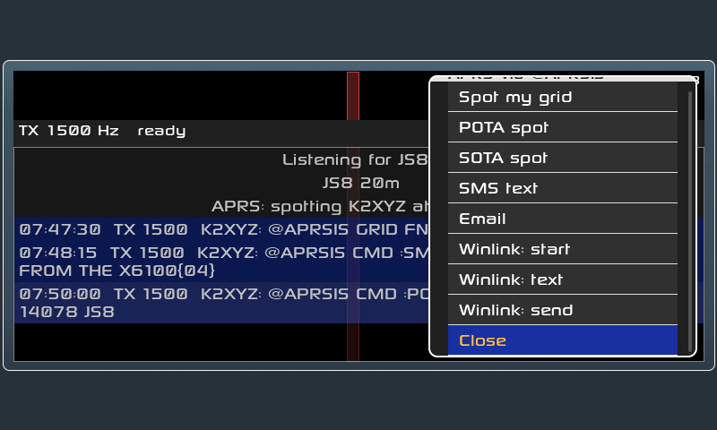 | 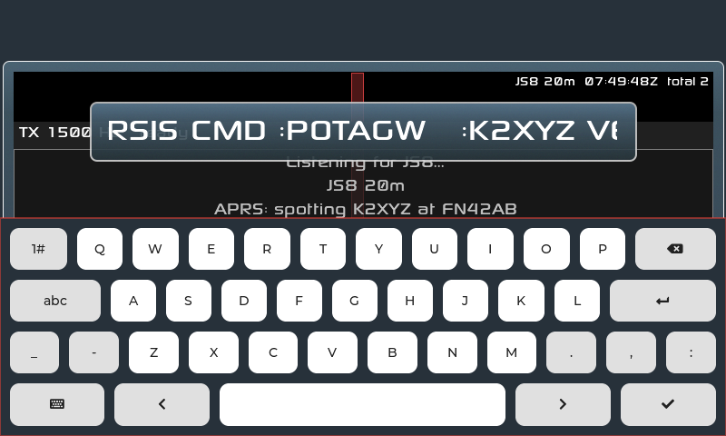 |

## Lineage

| Layer | Project |
|-------|---------|
| Firmware GUI | [gdyuldin/x6100_gui](https://github.com/gdyuldin/x6100_gui) v0.34.2 (R1CBU firmware, originally by Oleg Belousov R1CBU, maintained by Georgy Dyuldin R2RFE) |
| SWL additions | [TheMurusTeam/custom-r1cbu](https://github.com/TheMurusTeam/custom-r1cbu) 0.34.2 beta 6 by Hany El Imam 1KO125: WeFax, NavTex, channel list, broadcast info |
| JS8 engine | `core/` from [JS8Call-improved/Android-port](https://github.com/JS8Call-improved/Android-port), a Qt-free C++ port of [JS8Call](https://github.com/js8call/js8call) by Jordan Sherer KN4CRD and contributors |

Git history keeps these layers apart. The upstream x6100_gui history is
intact up to tag `v0.34.2`. Commit `20c4b77` imports the 1KO125 source,
which is published only inside that project's release tarballs. Everything
after that commit is the JS8 work.

## How it fits together

```
radio audio 44.1 kHz ─► dsp.cpp ÷4 ─► 11025 Hz float ─► dialog_js8 audio_cb
                                                          │
                          src/js8 (no LVGL, host-testable)│
                          ┌───────────────────────────────▼──┐
                          │ resample 11025 → 12000 Hz        │
                          │ js8core engine: 60 s UTC ring,   │
                          │   slot scheduling, decode thread │
                          │ frame → text, multi-frame join   │
                          └──────────────┬───────────────────┘
                                         ▼
                        dialog_js8.c: waterfall + band activity
```

JS8 Normal uses the same waveform as FT8: 79 8-FSK symbols of 0.16 s at
6.25 Hz spacing, 15 s slots, and the same Costas sync. It differs in the
error-correcting code (LDPC 174,87 with CRC-12 instead of 174,91 with
CRC-14), in the absence of Gray coding, and in its message layer. See
[docs/RESEARCH.md](docs/RESEARCH.md) for the full comparison and for why
the Android port's core was chosen over porting desktop JS8Call.

## Roadmap

- [x] Research: firmware, JS8 protocol, existing ports
- [x] Vendor js8core with small documented patches ([UPSTREAM.md](third-party/js8core/UPSTREAM.md))
- [x] `src/js8` RX library + host tests (x86 with ASan/UBSan, and ARM under qemu)
- [x] JS8 app on APP 3:3: waterfall, message list, filters, test mode
- [x] JS8 band presets (DB migration 4)
- [x] Headless UI harness and test-audio generator
- [x] CI image build with JS8 dependencies (GitHub Actions, manual dispatch)
- [x] First boot on a radio: WAV test mode, then on-air RX (2026-09-24, 40 m)
- [x] Decode load on the Cortex-A7: ~0.5 s CPU per 15 s cycle, app ~15 % of the 4 cores
- [x] Transmit, manual: reply, directed messages, free text, CQ, stop ([plan](docs/TX_PLAN.md), phases T1–T2)
- [x] Transmit on air: heartbeat acked by KK6WVY, INFO? answered by KN6OEH (2026-09-24)
- [x] Heartbeat, query shortcuts, Hold offset, Stations view with "heard you" (T3)
- [x] Opt-in auto-reply, heartbeat interval, heartbeat acks, idle watchdog (T4)
- [x] Time Sync from decode DTs, APRS page (grid, POTA, SOTA, SMS, email, Winlink)
- [x] ADIF logging with a log prompt, POTA/SOTA activation fields (T5)
- [ ] An inbox for MSG (T5)
- [x] GPS-fed grid for APRS spots
- [ ] Fast / Turbo / Slow submodes

## Testing

| What | How |
|---|---|
| Library unit + end-to-end tests | `tests/test_js8.cpp` (Catch2): resampler image rejection, rendering and assembly of frames made by JS8Call's encoder, the Android port's assembly tests, checksums, clock realign and gap fill, auto-reply rules, QSO tracking and ADIF records, and 11025 Hz audio → decoded message. `[.slow]` adds real-time WAV test mode. |
| The real UI on a PC | [tools/js8_ui_harness](tools/js8_ui_harness): the actual dialog on stock LVGL with a simulated busy band, in real time, under ASan/UBSan. |
| On the radio, without RF | [test-audio](test-audio) (the Test WAV button was removed once on-air receive worked; the library's WAV mode remains). |
| Radio compiler | Everything JS8 compiles cleanly with the image's GCC 12.3 (Cortex-A7, NEON) against Boost 1.80. |

## Building

The SD card image is built by GitHub Actions (`.github/workflows/main.yml`)
on each pushed tag, using
[AetherX6100Buildroot](https://github.com/gdyuldin/AetherX6100Buildroot).
Upstream build instructions are in
[docs/UPSTREAM_README.md](docs/UPSTREAM_README.md).

## License

The GUI is LGPL-2.1-or-later (`LICENSE`). The vendored js8core is GPLv3
(`third-party/js8core/LICENSE`), so a firmware image that includes it is
distributed under GPLv3.
