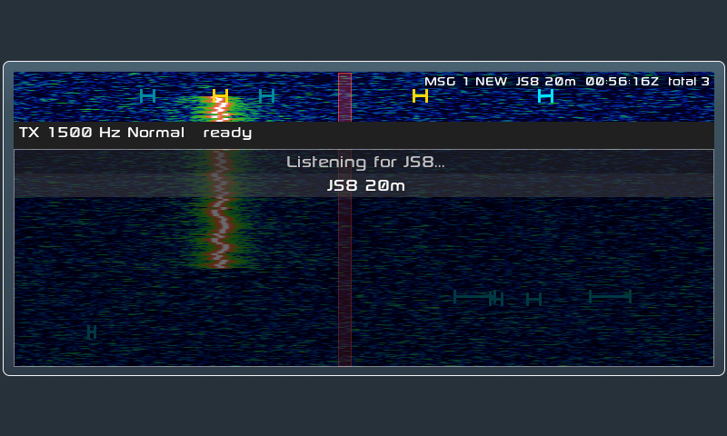
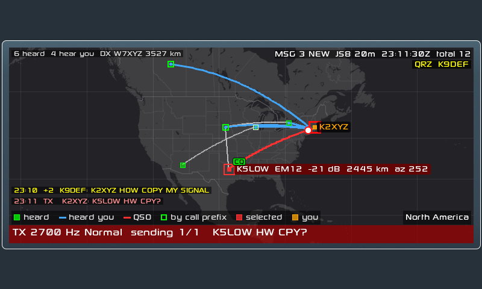
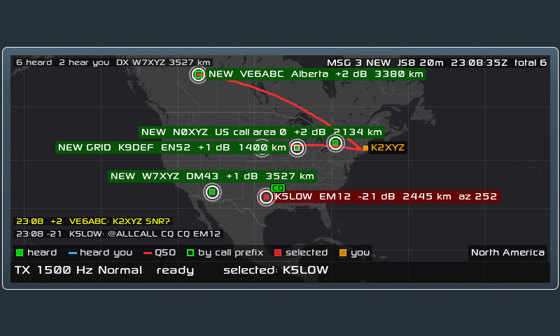

# X6100 JS8

**JS8 on the Xiegu X6100, running on the radio itself.** No PC, phone or
tablet: the decoder, keyboard, waterfall, logbook and inbox all live in
the radio's firmware, next to the FT8, RTTY, WeFax and NavTex apps.

> **Beta 4** is the current release. In daily use on the air since beta 1:
> heartbeats acknowledged, queries answered, QSOs and messages with desktop
> JS8Call stations, all four speeds decoding, two-way SMS through APRS.
> Beta 4 adds a **map** of the stations heard in GridTracker's style,
> decode marks on the waterfall, messages sent exactly as desktop JS8Call
> sends them, automatic replies that follow desktop's rules, and the fixes
> from a full code review ([New in beta 4](#new-in-beta-4)). Nothing
> transmits by itself when the app opens; automatic replies and heartbeats
> are switches you turn on.

*On the radio (beta 3 colours): our heartbeats acknowledged by KK7RFI
(+07, to us), other stations' traffic, and a CQ sent at Turbo speed (`T`).*

## Contents

- [What it does](#what-it-does)
- [Installing](#installing)
- [First steps](#first-steps)
- [The screen](#the-screen)
- [The map](#the-map)
- [The buttons](#the-buttons)
- [Transmitting](#transmitting)
- [Speeds](#speeds)
- [Messages and the Inbox](#messages-and-the-inbox)
- [Relays](#relays)
- [Settings](#settings)
- [Logging](#logging)
- [Alerts](#alerts)
- [APRS](#aprs)
- [Files on the SD card](#files-on-the-sd-card)
- [New in beta 4](#new-in-beta-4)
- [Known issues in beta 4](#known-issues-in-beta-4)
- [Coming next](#coming-next)
- [Bug reports and feature requests](#bug-reports-and-feature-requests)
- [Credits](#credits)
- [For developers](#for-developers)

## What it does

- **Receive and send JS8** as desktop JS8Call does: the same decoder, frame
  building, timing, commands and replies, so desktop users see nothing
  unusual.
- **All four speeds** (Normal, Fast, Turbo, Slow) decoded at once; send at
  any of them.
- **One-press messages:** CQ, heartbeat, HW CPY?, SNR?, GRID?, INFO?,
  STATUS?, HEARING?, AGN?, RR, 73.
- **Automatic replies, heartbeats and heartbeat acks**, each an opt-in
  switch, as on desktop.
- **Inbox** for `MSG` messages, sending messages, and **holding messages
  for other stations** (store and forward).
- **ADIF log** in desktop JS8Call's format, with a prompt when a QSO ends,
  and POTA/SOTA activation fields.
- **Alerts:** a beep for messages, CQs or new stations, and alert words
  (calls or words you choose) highlighted in purple.
- **APRS through JS8 gateways:** grid and GPS position beacons (with an
  optional message, e.g. `MADE IT TO CAMP`), POTA and SOTA spots on any
  frequency and mode, SMS, email and Winlink.
- **JS8Call's, GhostNet's or your own frequencies** on the band keys.
- **Time Sync** from the decodes, and a Stations view of who is on and who
  heard you.
- **A map** of the stations heard, in GridTracker's style: paths to who
  heard you, new stations popping up, your continent or the world.
- **Decode marks** on the waterfall (optional), as desktop's *Show decode
  attempts*: where the decoder is trying, even signals too weak to see.

## Installing

1. Open [Releases](https://github.com/randal007/x6100-js8/releases) and
   download `sdcard.js8-beta4.img.zip` from the Assets.
2. Write it to a microSD card with [balenaEtcher](https://etcher.balena.io/)
   or Rufus (they unzip it for you). Any card of 1 GB or more works.
3. Put the card in the radio and switch on. The first start creates the
   card's **DATA** partition, where your settings and logs live.

**Updating from an earlier build:** writing a new image replaces the whole
card, DATA included. Copy the DATA partition's files to your PC first
(at least `params.db`, `qso_log.db`, the `.adi` logs and the `js8_*.txt`
files), write the new image, start the radio once, then copy them back.

**This is a complete firmware** (the R1CBU/1KO125 X6100 GUI with JS8
added), so everything else on the radio works as before. To go back, write
the image you used before.

## First steps

1. **Callsign and grid:** APP → Callsign, and APP → QTH (4 or 6
   characters). JS8 won't send without a callsign.
2. **Clock:** JS8 needs the radio's clock within about 2 seconds. WiFi sets
   it automatically; otherwise set it in SETTINGS, then use **Time Sync
   now** (page 4, **Settings…**, the first line) once some stations have
   decoded. Like desktop JS8Call's time drift, it shifts only JS8's own
   timing to match theirs (the top line shows `drift +1.2s`); the radio's
   clock isn't touched. The drift lasts until the radio is switched off;
   **Reset time drift** (the next line) undoes it.
3. **Open JS8:** APP → page 3 → **JS8**. The radio tunes the nearest JS8
   frequency; the **band keys** step through JS8Call's standard frequencies
   (160 m to 6 m), or GhostNet's, or you can type your own (**Freq**, page
   6). While JS8 is open the receive filter is 200–3000 Hz, the transmit
   filter 160–3000 Hz (the radio's default), noise reduction, the noise
   blanker and the notch filters are off, and power is capped at 5 W; all
   go back when you leave.
4. **Answer someone:** turn the **MFK** to select their row, then **HW
   CPY?** (page 1) for the usual reply to a CQ, **Reply** (page 2) to type,
   or **Query >** (page 1) for the one-press messages.
5. **Stop sending:** **ESC** or press the **top knob**. The next ESC
   leaves the app.

## The screen

| Reply keyboard | Stations view |
|---|---|
|  |  |

**Waterfall** (top): the band, 200–3000 Hz. The **red band** is where you
transmit (turn the **main tuning knob** to move it); the **green line**
marks the selected station.

**Decode marks** (Settings, off to start), as desktop JS8Call's *Show
decode attempts*: a bracket `|—|` as wide as the signal wherever the
decoder found a JS8 signal and tried it, drawn as it tries and scrolling
down with the waterfall. **Yellow** = decoded. **Cyan** or **white** =
found but not (yet) decoded: someone is there, often too weak to see on
the waterfall, e.g. an answer on your own offset. Dim cyan = a faint
maybe, mostly noise (desktop shows those too). With *Decode: All speeds*
the other speeds' decoders look as well, so a mark can be wider or
narrower than the signal it sits on.

**Selecting a station:** turn the **MFK** onto one of their rows. They
stay selected while new messages arrive: their rows get a green bar at
the left, the TX bar says `selected: CALL`, and the green line follows
them if they move. Only another MFK move (or **Clear**, or a change of band or frequency)
changes it. The list keeps showing the newest lines; if you scroll up to
read, it goes back to following them 30 s after you last turned the MFK.

**Rows without a callsign:** later lines of a QSO often don't carry the
sender's call. Their rows count as the selected station's when they're on
its frequency (they get the green bar too). With the MFK on such a row,
nobody new is selected (Reply still goes to the selected station), but
every row on that row's frequency gets the green bar, so you can read
that conversation.

**Locking a station:** hold the **MFK** (half a second) on their row. The
TX bar says `locked: CALL` in red, and turning the MFK then only scrolls:
the selection stays put while you read back. Press another station's row
to select it (that ends the lock), hold the locked one again, or open the
Stations view (the station stays selected there, unlocked).

**Status line** (top right): what's switched on (`AUTO`, `HB 10m next
00:14`, `ACK`, `MSG 1 NEW`), the band, UTC time and how many messages
have been decoded.

**TX bar:** your offset and speed, then how far the message has got
("1/3 starts in 9 s", "sending 2/3") and its text; a long message is cut
short at the end, never the count. When nothing is queued it shows the
selected station and `auto CQ` when it's on. It turns red while you're on
the air.

**Typing** (Reply, Send…): the text box sits at the top of the screen and
the list stays in view, following the other station's message as it
grows, so you can type your answer while they're still sending. With the
on-screen keyboard the list moves up into the space above it. A USB
keyboard works too; lowercase is typed as capitals.

**The list** shows UTC time, SNR, audio offset, the speed if not Normal
(`F`, `T`, `S`) and the message:

| Row | Means |
|---|---|
| red | sent by you |
| blue | to you |
| green | a CQ |
| grey text | heartbeats |
| dark blue | to a group (`@ALLCALL`, `@HB`, ...) |
| purple | contains one of your [alert words](#alerts) |
| `[...]` | a low-confidence decode |
| ends in `...` | a long message still arriving; the row grows each decode cycle. On your own (red) rows: still going out |
| ends in `♢` | the message's last frame arrived (desktop's end-of-transmission mark). On your own rows: its last frame has gone out |
| `(stopped 2/5)` | your message was stopped during frame 2 of 5 (ESC, or JS8 closed while sending) |
| yellow words | the command (`SNR?`, `MSG`, `ACK`, `>`, `CQ CQ CQ` ...) |

**Stations view** (page 3, *Show Stations*; press again for [the map](#the-map)): one row per station, like
desktop's Call Activity. `*` and gold: they heard you (they replied or
acknowledged your heartbeat), with the report they gave you ("heard you
−13"). Then time since heard, their SNR here, speed, grid, distance and
bearing (degrees from north). Calls you've logged are green. Stations
named in a relay that reached you show *via* the station that passed it
on, as on desktop. Stations drop off an hour after they were last heard
(*Stations kept* in [Settings](#settings)).

**Grids** come from heartbeats, CQs and `GRID` replies (`GRID FN42AB`
anywhere in a message counts too), as on desktop; another grid-shaped word
in a message (`MY DAUGHTER LIVES IN EM12`) doesn't. Longer grids are kept
to 6 characters, the most precise one wins, and the `RR73` sign-off is
never mistaken for a grid.

## The map

Page 3, **Show Stations** twice (*Show Map*): the stations of this
frequency on a world map in place of the waterfall and the list, in
GridTracker's *Dark Gray* look. The map fills the whole window, out to its
white border.

- **Green squares:** stations heard, in the middle of their grid square. **Hollow
  boxes:** no grid heard yet, so placed by callsign — the middle of their
  province, state or call area where the call says (VE7 → British Columbia,
  W6 → US call area 6, VK2 → New South Wales, JA1 → Kanto), else their
  country (AD1C's country file).
- **Blue curved lines:** great-circle paths to the stations that heard
  you, ending in a dot. **Red** while a message to or from you is on the
  air: from a station's first frame to you until 30 s after its last (it
  also gets the flashing ring, "calling you", unless it's only a
  heartbeat reply), and to the station you're sending to (Reply, a query,
  HW CPY? ...), even if it hasn't heard you yet.
- **QRZ** (yellow, under the status line and the stats, GridTracker's "calling me"):
  who sent something to your call — a message, a command, free text, not
  heartbeat replies — while the map or the Stations view was showing, e.g.
  `QRZ 2  K9DEF W7XYZ`, newest first. For when you've walked away: a
  station leaves it when you select it or send to it, and it clears when
  you go back to the message list.
- **Orange:** you (your grid, APP → QTH), **outlined in red while you
  transmit** (as the TX bar turns red: heartbeats, replies, anything). **Red:** the selected station,
  with its call, grid, SNR, how they hear you and the distance. Turn the
  **MFK** to step through the stations: it's the Stations view's selection,
  so Reply, Query, HW CPY? ... work as usual.
- **New stations** pop up for 8 seconds with a flashing ring and their
  details, then just their square stays. Never worked (the radio's QSO
  log, the one FT8 and JS8 log to): **NEW DXCC Japan** or **NEW GRID**
  in the pop-up, and a **white outline** on the square until you log a
  QSO with them.
- Squares are a little smaller than their grid square. **They fade** the longer a station goes unheard (to 30 % after 45
  minutes; the selected one and a QSO never fade), and are **a little
  bigger for a strong signal**, a little smaller for a weak one (a few
  pixels at most, so they don't take over).
- **CQ** tag: on a station's corner for 5 minutes after it called CQ (and
  its row in the Stations view is green for those 5 minutes, the green of
  CQ rows in the message list). Yours too: on your square while your CQ
  goes out and for 5 minutes after it.
- **Grey lines:** other stations talking to each other (`W7XYZ: K9DEF
  HW CPY?`), a relay's hops too, fading out over 10 minutes; drawn when
  both ends are on the map.
- **Moving dots:** while you send to a station (Reply, HW CPY? ...), a
  white dot runs along the red path from you to them, frame by frame, as a
  progress bar; each frame to you sends a yellow dot from them to you.
- **The last two messages** (as the message list shows them, its Show
  filter too) above the legend; yours light red, to you yellow.
- **Follow:** hold the **Map:** button: the view frames you and the
  selected station, however far, and its label adds the long-path heading
  (`az 335  LP 155`); press Map: to go back.
- The legend, the message lines, the status line and the TX bar are
  see-through: the map shows around and under the text.
- **Stats** (top right, under the status line): `14 heard  5 hear you  DX JA1ABC 10833 km`, the
  whole Stations list whatever Show picks. The selected station's label
  also has the beam heading (`az 252`, short path).

  

- **Map: Auto** (page 3, second button) shows your continent close-in and
  switches to the world by itself when someone on another continent is
  heard, back again when they age off the Stations list. **Close-in** stays
  on your continent; **World** shows the whole world (it repeats at the
  sides, as a web map does, so there are no empty bars). Each view zooms to fit
  the stations shown. **Show** (page 2): *All heard* or only those who
  *Heard me*.
- The TX bar moves to the bottom of the map; decoding goes on as usual.
  (The TX bar is half see-through on every page now: the waterfall shows
  through it on the message and Stations pages.)

## The buttons

The first button on each row turns the page (`JS8 1:6` … `6:6`); hold it
to go back a page. In JS8 a hold is half a second.

| Page | Button | Does |
|---|---|---|
| 1 | **CQ** | `CQ CQ CQ <grid>`. Pauses heartbeats for 10 minutes, like anything you send (see [Transmitting](#transmitting)). **Hold for auto CQ**: one now, and the main knob sets how many minutes after each CQ ends the next one goes (1–30, remembered; press CQ when done, or hold CQ later to change it; answers and heartbeats sent in between don't move it). The button then counts down, until someone answers you, you reply to someone, press CQ again, stop TX, change band or frequency, or leave it alone for an hour. |
| 1 | **Heartbeat** | One heartbeat now: on your own offset if that is 1000 Hz or below, else at a free spot in the 500–1000 Hz heartbeat sub-band (clear of anything heard in the last 30 s), as desktop. With HB on, the automatic ones count again from this one. |
| 1 | **Query >** | One-press messages to the selected station: SNR?, Send SNR, GRID?, My grid, INFO?, STATUS?, HEARING?, AGN?, RR, 73, Message…, Message via them…, Any messages?, Fetch message #…, Relay via them…, Can they reach…? |
| 1 | **HW CPY?** | Sends `CALL HW CPY?` ("how do you copy?") to the selected station. |
| 2 | **Show: No HB / Directed / All** | Filter the list. *No HB* (the default): everything except heartbeats and SNR reports (mostly answers to heartbeats), unless they are to you. *Directed*: messages to you or to groups, plus everything on the selected station's frequency (in a long QSO the other side often drops your call). In the Stations view, the first press goes back to the messages. On [the map](#the-map): **All heard / Heard me**. |
| 2 | **Reply** | Keyboard with the selected station's call filled in. If they asked you something with AUTO off, the answer is ready instead (each station its own, for 5 minutes). |
| 2 | **Send…** | Keyboard, empty: `@ALLCALL …`, a call and a message, or free text. |
| 2 | **Clear** | Clear the list and this frequency's Stations list. |
| 3 | **Map: Auto / Close-in / World** | Only while [the map](#the-map) shows (blank otherwise): which part of the world it shows. **Hold: Follow** the selected station (you and them framed, the long path too); press to stop. *Time Sync* moved to Settings to make room. |
| 3 | **Hold: Off / On** | Off: Reply and Query move your offset to the station's first. On: stay on your own offset. |
| 3 | **Show Stations / Map / Messages** | Step through the message list, the Stations view and [the map](#the-map). Each frequency has its own Stations list: change band and back, and it's still there. The lists last while the radio is on, JS8 closed and reopened included; a station drops off when it hasn't been heard for *Stations kept* ([Settings](#settings); an hour to start). |
| 3 | **Inbox** | Your messages, and messages held for others. Shows *N new* and turns green while you have unread messages. |
| 4 | **AUTO: Off / On** | Answer questions sent to you automatically (see [Transmitting](#transmitting)). |
| 4 | **HB: Off / N min** | Heartbeats every N minutes. When you switch it on, the main knob sets 5–30 min; press HB again to finish. Hold HB to change the interval. Shows *paused* for 10 minutes after you send something; press it then to resume at once. |
| 4 | **HB ACK** | Acknowledge others' heartbeats (needs AUTO and HB on, as on desktop). |
| 4 | **Settings…** | Time Sync, INFO and STATUS (what AUTO sends for INFO? and STATUS?), Relay, your groups, how long stations and messages stay listed, km or miles, decode marks and an operator's call: see [Settings](#settings). |
| 5 | **APRS >** | [APRS](#aprs) spots and messages. |
| 5 | **Log QSO** | [Log](#logging) the QSO that just ended, or the selected station if you've selected someone else since. |
| 5 | **Activ.: Off / POTA / SOTA** | Activating a park or summit: added to every log entry. Hold to type it. |
| 5 | **Log prompt: On / Off** | Offer to log when a QSO ends with 73 or SK. |
| 6 | **Alerts >** | [Alerts](#alerts): beeps and alert words. |
| 6 | **Speed** | The [speed](#speeds) you send at. Press to cycle; hold to match the selected station. |
| 6 | **Decode: All speeds / My speed** | Decode every speed (default), or only yours. |
| 6 | **Freq: JS8 / GhostNet / kHz** | Which frequencies the band keys step through: **JS8Call's** (7.078, 14.078 …) or **GhostNet's** (3.575, 7.107, 14.107 MHz), tuning the closest one. Or **Custom kHz…**: type a dial frequency (e.g. `7107.5`; the last one is filled in). The band keys go from a custom frequency back to the list. |

While a list is open (Query, Settings…, APRS, the POTA/SOTA spot form, Log,
Inbox, Alerts, Freq), any other button just closes it; press again to do
the thing. ESC closes lists too, and the VOL knob works in all of them.

| Query list | Log popup |
|---|---|
|  |  |

## Transmitting

- **Offset:** the main tuning knob moves your TX offset (the red band),
  500 Hz up to where the signal would pass 3000 Hz. The dial frequency
  stays locked. With **Hold: Off**, replying moves your offset to theirs.
- **Power** is capped at 5 W while JS8 is open, as in the FT8 app. The
  level is learned and shared with FT8.
- **Stop:** ESC or the top knob, at any moment.
- **Nothing sends by itself** unless you switch it on. AUTO, HB and HB ACK
  are off every time the app opens, and the status line shows what's on:
  - **AUTO** answers SNR?, GRID?, INFO?, STATUS?, HEARING?, AGN?, message
    ACKs and message queries sent to your call, and passes
    [relays](#relays) on, as desktop JS8Call does. With AUTO off, each
    answer waits on **Reply** for you to send (desktop answers `QUERY
    MSGS`, `QUERY CALL` and anything to `@ALLCALL` only with AUTO on, so
    those don't wait). With AUTO on it also tells a station you hold a
    message for, when you hear them, with `W1ABC RETRIEVE MSG 3` (at most
    every 15 minutes, once per message every 8 hours).
  - Automatic answers take turns: several can wait while you're sending or
    typing (up to 2 minutes each), and go out one after another. Lists
    (Inbox, Log, Settings…) don't hold them up. As on desktop, a question
    asked again is answered again, a station's `@ALLCALL` or heartbeat is
    answered at most once every 55 minutes, and **nothing automatic
    answers while a message to you is still arriving** (you can't hear its
    next frames while you send); no HB ACK goes out while anyone's message
    is still arriving.
  - **HB** sends heartbeats on desktop's fixed schedule: every N minutes on
    the slot grid, the first N minutes after you switch it on; one that had
    to wait doesn't move the ones after it. **HB ACK** acknowledges others'
    heartbeats.
  - Anything you send yourself except a heartbeat (Reply, Send…, a Query
    item, CQ, HW CPY? …) **pauses** HB and HB ACK, so heartbeats don't cut
    into a QSO. The buttons show *paused* and the status line when they
    resume: 10 minutes after the last message you sent. They stay switched
    on; press HB to resume sooner. Messages you receive and AUTO's answers
    don't pause them. After an hour without touching the radio, automatic
    sending pauses until you press something.

## Speeds

JS8 has four speeds (desktop JS8Call's figures):

| Speed | Slot | Width | Decodes down to | Marked |
|---|---|---|---|---|
| Normal | 15 s | 50 Hz | −24 dB | |
| Fast | 10 s | 80 Hz | −22 dB | `F` |
| Turbo | 6 s | 160 Hz | −20 dB | `T` |
| Slow | 30 s | 25 Hz | −28 dB | `S` |

- **Receiving:** all four at once, as desktop's multi-decoder does; the
  list and Stations view mark `F`, `T` and `S`. *Decode: My speed* (page 6)
  decodes only your speed.
- **Sending:** everything goes at the speed on page 6, automatic replies
  included. Replying to someone heard at another speed warns you; **hold
  Speed** to switch to theirs.
- **Heartbeats:** none in Turbo, as on desktop.

## Messages and the Inbox

| Inbox | Reading a message |
|---|---|
|  |  |

**Receiving:** a `MSG` sent to you goes to the Inbox (page 3). The status
line shows `MSG 1 NEW` and the **Inbox** button turns green until you've
read it. The sender expects an `ACK`: AUTO sends it, or **Reply** has it
ready. A message that came through a [relay](#relays) shows the way it
came (*VE7ABC via W1ABC*) and is ACKed back the same way; a `MSG` to one
of your [groups](#settings) goes to the Inbox too. Messages an APRS
gateway passes on to you (`@APRSIS MSG TO:<your call> …`) arrive from
*APRS*, as on desktop, without an ACK.

**The Inbox** lists every message (up to 200), newest first, and opens on
the newest unread one (`*`). Open one to read
it all. **Reply** writes back the way it came. For a message someone held
for you (`… FROM N0XYZ`) there are desktop's other two choices as well:
**Reply to N0XYZ via** the station that held it (`MSG TO:N0XYZ`, held
there for them), or straight to N0XYZ. When it ends `NEXT MSG ID 4`,
**Fetch the next** asks for it. An APRS message's Reply is an APRS
message to its sender. **Delete** removes it. *New message to …* writes
to the selected station.

**Sending**, from the Query list with a station selected:

| Item | Sends | For |
|---|---|---|
| Message… | `N0XYZ MSG <text>` | their inbox |
| Message via them… | `N0XYZ MSG TO:W1ABC <text>` | N0XYZ holds it until W1ABC asks |
| Any messages? | `N0XYZ QUERY MSGS` | they answer `YES MSG ID 3` (`+2`: two more after it) or `NO` |
| Fetch message #… | `N0XYZ QUERY MSG 3` | the message they hold for you |
| Relay via them… | `N0XYZ>W1ABC <text>` | N0XYZ passes it on to W1ABC ([Relays](#relays)) |
| Can they reach…? | `N0XYZ QUERY CALL W1ABC?` | N0XYZ answers `YES -12 (5m)` if they've heard W1ABC |

When a station says it holds a message for you (`YES MSG ID 3`, `MSG ID
3` on a heartbeat ack, or `RETRIEVE MSG 3`), **Reply** has `QUERY MSG 3`
ready to fetch it.

**Holding messages for others** (store and forward), as desktop JS8Call
does it:

- A `MSG TO:W1ABC` sent to you is kept for W1ABC (Inbox → *Held for
  others*) and ACKed.
- W1ABC finds out when they ask (`QUERY MSGS`, to you or to everyone with
  `@ALLCALL QUERY MSGS`), from your heartbeat ack (`MSG ID 3`, with HB ACK
  on), or from your `W1ABC RETRIEVE MSG 3` when you hear them (AUTO on).
  With more than one waiting the answer says so: `YES MSG ID 3 +2`.
- W1ABC fetches it with `QUERY MSG 3` and gets `W1ABC MSG <text> FROM
  <sender>`, with `NEXT MSG ID 4` when another is waiting. It's marked
  *(sent)* once it has gone out in full; if you stop it halfway, it stays
  held. If W1ABC asks again, it goes again straight away (they didn't get
  it).
- `MSG TO:@NET` holds a message for a group: anyone asking the group
  (`@NET QUERY MSGS`) gets it, for two days, if `@NET` is one of your
  [groups](#settings).
- As always, AUTO sends these answers, or they wait on Reply. Switching
  **Relay** off in Settings stops holding messages for others, as on
  desktop.

**HW CPY?** sent to you: **Reply** has your signal report ready.

## Relays

A relay reaches a station you can't hear through one you can, as in
desktop JS8Call. With W1ABC out of reach but N0XYZ hearing you both:

1. You send `N0XYZ>W1ABC HELLO` (Query → **Relay via them…**, or type it).
2. N0XYZ's station passes it on by itself as `W1ABC>HELLO *DE* <you>`.
3. W1ABC's station answers `N0XYZ><you> ACK`, which N0XYZ passes back to
   you. If the relay carried a question (`SNR?`, `INFO?`, `QUERY MSGS` …)
   or a `MSG`/`MSG TO:`, that's answered instead, the same way back.

Your radio does all of this for others: with **Relay** on (the default,
in Settings) and AUTO on, relays to you are passed on and relays ending
at you are answered; with AUTO off, **Reply** has them ready, as desktop's
outgoing box does. More hops work too: `N0XYZ>W1ABC>VE7ABC HI`. Relays
ending at you with plain text are ACKed but not kept (desktop doesn't
keep them either); a relayed `MSG` goes to the Inbox.

## Settings

Page 4 **Settings…**:

| Line | Does |
|---|---|
| **Time Sync now** | Shift JS8's timing to match the last 2 minutes of decodes (needs 3 or more; with 3 or more stations, each counts once), like desktop's time drift; the radio's clock isn't changed (the line shows the drift). Pressing it again right after is safe. Not while sending. It was page 3's button. |
| **Reset time drift** | Back on the radio's clock. |
| **INFO: …** | What AUTO sends for INFO? |
| **STATUS: …** | What AUTO sends for STATUS? |
| **Relay: On / Off** | Press to switch. On (the default, as on desktop): relays are passed on and `MSG TO:` messages held for others. Off: both are ignored (desktop's *Disable message relay*). |
| **Groups: …** | The groups you're in, e.g. `@NET @CANADA` (desktop's *My groups*): messages and questions to them are answered as if to you, and `MSG TO:@NET` messages are held for their members. |
| **Stations kept: …** | Press to change: how long a station stays in the Stations view after it was last heard (15 min to 6 hours, or always; 1 hour to start). |
| **Messages kept: …** | Press to change: messages leave the list this long after they arrived (15 min to 2 hours), or *all* (the default: the list keeps the newest 150 to 200 messages; it's trimmed back to 150 when it reaches 200). |
| **Distance: km / miles** | Press to switch the Stations view's distances (km to start). |
| **Decode marks: On / Off** | Press to switch the [decode marks](#the-screen) on the waterfall (off to start, as desktop). |
| **Operator: …** | Someone else operating your station (desktop's *Operator Callsign*): their call goes in the log as `OPERATOR`; your station call is still what's sent on the air and logged as `STATION_CALLSIGN`. Empty: the station call. |

## Logging

The Log popup (page 5 **Log QSO**, or by itself when a QSO ends with 73 or
SK) is filled in for you: call, band, start and end, reports, frequency,
power, their grid and yours (from GPS if one is plugged in). Add a name or
comment, then **Save to log**. Nothing is logged without Save.

A QSO ends when 73, SK or RR73 comes among the last three words of a
message ("TNX QSO 73", "73 GL"), not anywhere ("73 DEGREES HERE" isn't an
end). ESC on the prompt means *not now*: **Log QSO** then logs whoever is
selected, and the ended QSO is still there when you select that station
(for 30 minutes). A grid you type must be a real one (`CN89`, `CN89KG`); it's
saved in capitals. A station's grid only comes from its heartbeats, CQs and
GRID replies, as on desktop, not from any grid-shaped word it sends.

- Saved to **`js8call_log.adi`** on the SD card's DATA partition, in desktop
  JS8Call's ADIF format (`MODE MFSK`, `SUBMODE JS8`), ready for your
  logger. FT8 keeps its own `ft_log.adi`.
- **Activating a park or summit:** page 5 *Activ.: POTA/SOTA* adds
  `MY_SIG`/`MY_SIG_INFO` or `MY_SOTA_REF` to every entry (hold the button
  to type the reference).
- Logged calls show green in the Stations view.

## Alerts

Page 6 **Alerts >**: a short beep for a message to you, an Inbox message,
a CQ or a new station (one not heard on this band since the radio was
switched on and not in your log for the band; each a switch), and
**alert words**: calls or
words you type (e.g. `VE7ABC @POTA SOTA`). Decodes containing them beep
twice and show purple, in the list and the Stations view. **Test beep**
plays it. Beeps never sound while transmitting.

Beeps play through the speaker the way the radio's voice prompts do. The
radio also feeds them back into its receive audio, so for under a second
around each beep JS8 hears silence instead and the waterfall pauses;
decoding carries on.

## APRS

JS8Call stations with "spot to APRS" on forward `@APRSIS` messages to
APRS-IS. Page 5 **APRS >** builds them (as desktop JS8Call and KF7MIX's
JS8Spotter do):

| Item | Sends | You type |
|---|---|---|
| Spot my grid | `@APRSIS GRID CN89LH`, or with a message `@APRSIS CMD =4916.25N/12305.00WGMADE IT TO CAMP` | a message, or just Enter |
| Spot GPS position | the same from your GPS fix: `@APRSIS GRID CN89KG12AB` or a position with the message | a message, or just Enter (needs a GPS on the radio) |
| POTA spot | `@APRSIS CMD :APSPOT   :! POTA CA-1234 7.078 DATA JS8` | nothing: a [spot form](#pota-and-sota-spots) |
| SOTA spot | `@APRSIS CMD :APRS2SOTA:VE7/LM-001 7.078 DATA CALL JS8` | nothing: a [spot form](#pota-and-sota-spots) |
| SMS text | `@APRSIS CMD :SMS      :@6045551234 message` | number and message ([NA7Q's gateway](https://na7q.com/sms-gateway/), opt-in needed) |
| Email | `@APRSIS CMD :EMAIL-2  :address message` | address and message |
| Winlink: start / text / send | `SP address subject`, a line of text, `/EX` | [APRSLink](https://winlink.org/APRSLink)'s three steps |

Nothing reaches APRS unless a gateway station hears you. Replies (an SMS
answer, a gateway's confirmation) go to your call on APRS-IS (aprs.fi shows
them); they come back to the radio only if a JS8Call-improved station with
*relaying inbound APRS messages* switched on has heard you lately. Its
`@APRSIS MSG TO:<your call> <text> DE <sender>` then lands in your Inbox,
from *APRS*, and **Reply by APRS** answers it. Older desktop JS8Call never
passes APRS messages back. APRS text is limited to 67 characters; an
SMS, email or Winlink message's number (`{04}`) comes on top.

**Two-way SMS works** (confirmed on the air 2026-09-28 with the beta 4
test build, through NR4U's gateway on 40 m): texts from a phone arrive in
the Inbox as `@6045551234 <text> DE SMS`, and a reply goes back to the
phone: open the text in the Inbox and choose **Reply by SMS to
@6045551234**; the keyboard opens with the number filled in, so you only
type your text. The gateway's receipt for your reply (`ACK04}`) shows as
**SMS {04} to @6045551234 delivered** on the message line and in the list
(or *rejected by the gateway* for a `REJ04}`); it isn't an Inbox message.
The app remembers what you sent until the radio is switched off. Beta 3
and earlier drop the relayed texts (gateways send them without the
checksum beta 3 expected): use beta 4 or later.

**Position with a message:** Spot my grid and Spot GPS position open a
text box. Press Enter on it empty for the plain position beacon (2 frames),
or type a message first (up to 43 characters, e.g. `MADE IT TO CAMP`): it
goes as an APRS position report with your message as its comment, shown
with your position on aprs.fi. The position is rounded to about 185 m,
which keeps it short: one or two words (`MADE IT`, `ARRIVED SAFE`) take 4
frames, about 20 letters 5. The line above the keyboard shows the frame
count as you type. (JS8's `GRID` command can't carry a message, so this
one goes as a raw APRS packet through `CMD`.) ESC sends nothing.

Confirmed on the air so far: the plain **Spot my grid** and **SMS** (both
ways). The other items follow desktop JS8Call's, JS8Spotter's and the
gateways' own formats (and survive JS8 encoding in our tests) but still
need testing through the gateways.

### POTA and SOTA spots

**POTA spot** and **SOTA spot** open a small form: **Send spot**, your
**Park** or **Summit**, the **Frequency**, **Mode** and a **Comment**.
The top line shows exactly what will be sent. Everything is remembered
for next time.

- **Frequency:** the JS8 dial you're on, or one you type. Press it: the
  keyboard opens with your last one filled in. Enter a frequency (kHz like
  `7185`, or MHz like `144.2` for VHF) to spot that, or clear it and press
  Enter to spot the JS8 dial again. Use it to spot your SSB or CW run while
  JS8 carries the spot.
- **Mode:** press to step through DATA, SSB, CW, FM, AM and FT8 (POTA) or
  DV (SOTA). JS8 is DATA.
- **Comment:** optional. With none, a spot of the JS8 dial says `JS8`.

Where they go:

- **POTA → [APSPOT](https://apspot.radio/getting-started/)**, which posts
  the spot to **pota.app** if you have a pota.app account. Park numbers
  are `CA-1234` / `US-1234` now (not `VE-` / `K-`). A comment containing
  the word `TEST` is checked but not posted, handy for a first try.
- **SOTA → [APRS2SOTA](https://www.sotaspots.co.uk/Aprs2Sota_Info.php)**,
  which posts to SOTAwatch. You must register first: email its operator
  your name and callsign (see its page).

A JS8Call station with APRS spotting on has to hear you, and the
gateway's reply ("Spotted", or what went wrong) goes to your callsign on
APRS, not back over JS8. Check the spot on pota.app / SOTAwatch, or your
messages on [aprs.fi](https://aprs.fi) or findu.com. More in
[docs/SPOTS_PLAN.md](docs/SPOTS_PLAN.md).

## Files on the SD card

All on the **DATA** partition, readable on a PC:

| File | What |
|---|---|
| `js8call_log.adi` | your JS8 log (ADIF) |
| `js8_inbox.txt` | Inbox messages, one per line |
| `js8_held.txt` | messages held for other stations |
| `js8_texts.txt` | INFO, STATUS, last POTA/SOTA references, spot frequency/mode/comment, alert words, groups, operator's call |
| `params.db`, `qso_log.db` | the radio's settings and QSO database |
| `incoming_log.adi` | put an ADIF log here to import it (worked-before marks) at the next start |

JS8 writes its files through a temporary `<name>.tmp` and renames it, so a
power cut leaves the old version or the new one; a `.tmp` left behind is
picked up at the next start. A file JS8 couldn't read (an SD card error)
is kept as `<name>.unreadable-<date>` and a new one started: your old
messages or settings are in it, readable on a PC.

## New in beta 4

New:

- **[Show Map](#the-map)** (Show Stations twice): the stations of this
  frequency on a world map in GridTracker's style. Grid squares (or the
  callsign's province, state or country when no grid was heard), curved
  paths to who heard you, red while a message to or from you is on the
  air, new stations popping up (**NEW DXCC** / **NEW GRID** from your QSO
  log), CQ tags, **QRZ** (who called you while you were away), other
  stations' QSOs in grey, a dot running along the path as your message goes
  out, squares fading as stations go quiet. Your continent close-in, the
  world when DX is heard, or **Follow** the selected station with its
  short- and long-path headings
- **Decode marks** on the waterfall (Settings), as desktop's *Show decode
  attempts*: where the decoder is trying, even signals too weak to see, and
  in yellow what it decoded
- **Two-way SMS:** replies relayed back over JS8 (an SMS answer) reach the
  Inbox; **Reply by SMS to @number** fills in the phone number, so you only
  type the text; the gateway's receipt (`ACK04}`) shows as "SMS {04} to
  @6045551234 delivered" instead of arriving as an Inbox message; SMS,
  email and Winlink get their full 67 characters
- **Hold the MFK** on a station to lock it: the knob then only scrolls,
  `locked: CALL` in red in the TX bar; press another station, hold again or
  open the Stations view to unlock
- **Colours and marks as desktop's:** commands in yellow (`SNR?`, `MSG`,
  `>`, `CQ CQ CQ` ...), desktop's end-of-message mark `♢` on messages whose
  last frame arrived; your own messages red (as when transmitting) and
  messages to you blue (the other way round before); your own messages
  show ` ...` while going out, `♢` once sent, `(stopped 2/5)` if you
  stopped it
- Rows without a callsign: the green bar marks those on the selected
  station's frequency, and with the MFK on one, every row on its frequency
- **Stations view:** bearing, km or miles, and stations heard through a
  relay listed *via* it, as on desktop
- **Settings:** km or miles, how long stations and messages stay listed,
  decode marks, an operator callsign different from the station's (logged
  as `OPERATOR`), and **Time Sync now** / **Reset time drift**, moved here
  from page 3 (that button is the map's view button now)
- **Heartbeats pause** for 10 minutes after anything you send yourself
  (not a heartbeat), then carry on by themselves; press HB to resume
  sooner. Before, any message to you (even an automatic query or a garbled
  one) switched HB and HB ACK off until you turned them back on
- The TX bar is half see-through on every page

Fixes:

- **Messages go out exactly as desktop JS8Call sends them**, checked frame
  by frame against desktop's own code at all four speeds. Before, desktop
  read "RR 73" as "RR 31", a message starting with a number lost it, a
  relay or `MSG TO:` / `QUERY CALL` to a call starting with a digit
  (2E0ABC) named the wrong station, and messages naming a callsign
  sometimes took an extra frame at Normal speed
- **Closing JS8 while it transmits is safe:** GEN, APP or another app in
  the middle of a frame used to crash the app with the radio still keyed
  until it restarted; now the frame stops and PTT drops at once
- The band keys wait until you stop sending ("Not while sending"), as the
  Freq list does; they used to send the rest of the message on the new
  band. After a change of band or frequency, automatic answers still
  waiting are dropped instead of going out on the new one
- **Automatic replies as desktop sends them:** answers queue (before, a
  second question or heartbeat while one answer waited replaced it, so a
  message's ACK could be lost); nothing automatic keys over a message to
  you that is still arriving; the Log prompt or any other list no longer
  holds up an unattended station, and AUTO's answers don't count as a QSO
  for the Log prompt; each station's answer waits on Reply (AUTO off), not
  just the last one; several held messages can be on their way at once;
  HB ACKs at most every 55 minutes per station and a question asked again
  answered again (desktop's rules); heartbeats on desktop's fixed schedule
  and offset; auto CQ counts only from our CQs; AGN? repeats what actually
  went out; `QUERY CALL` about a station heard only through a relay is
  answered; an `@APRSIS MSG` without `TO:` is no longer kept or ACKed
- **Your messages and settings are safer on the SD card:** a full Inbox
  (200 messages) no longer stops saving and announcing new ones (they were
  ACKed but lost); the Inbox, held messages and `js8_texts.txt` are written
  so that a power cut leaves the old or the new version, never an empty
  file; a file that can't be read is kept aside as
  `<name>.unreadable-<date>` and you're told, instead of the next save
  writing over it; a message that couldn't be saved gets no ACK, so the
  sender's station knows it didn't arrive; room for ten groups
- **A smoother screen, lighter work:** idle, JS8 no longer redraws the TX
  bar and the waterfall frame four times a second (about a million pixels
  a second for nothing); decoded messages can't be lost when the screen
  falls behind (a ~50 s stall used to lose every message on the band);
  waterfall rows, the station lists and the Stations view's worked-before
  marks cost less; a regular who isn't in your log alerts as a new station
  once per band, not each time they come back after an hour
- **Screen and keyboard:** the VOL knob works in every list (Inbox,
  Settings, APRS, Alerts, Freq, Log); a custom frequency, alert words or
  log fields can be typed before you've set a callsign, and Send… no
  longer opens in the frequency editor afterwards; the keyboard takes every
  character JS8 sends (`` $ % < > [ ] ^ | ~ \ ` ``); a message that's too
  long says so as you type; the Inbox lists all 200 and opens on the
  newest unread; info rows ("Auto: ...", "Held message 3 delivered") no
  longer vanish when the list is rebuilt; a message cut off by a band
  change stops showing "..."; Hold Speed matches the selected (locked)
  station
- **Logging:** Log QSO takes the selected station, a QSO ends on 73, SK or
  RR73 among the last three words (not "73 DEGREES HERE"), ESC on the
  prompt means *not now*, and a typed grid must be a real one
  ([Logging](#logging))
- **As desktop:** a message to VE7NHW/P isn't to you as VE7NHW; "Reply to
  HOME" is no longer offered for "... AWAY FROM HOME"; a message to a CQ7
  call isn't a CQ; a station's grid only comes from its heartbeats, CQs
  and GRID replies; alert words match with punctuation around them
  ("SOTA,")
- **APRS and relays:** a message relayed through many stations keeps its
  whole path for Reply (desktop has no limit either); a "RETRIEVE MSG"
  notice that couldn't go out is tried again at the next chance

All eight packages of the code review's
[fix plan](docs/review/fix-plan.md) are in (from the full review in
[docs/review](docs/review/) and the first
[bug hunt](docs/bug-hunt-2026-09-28.md)), with tests that run on GitHub
with every change.

**Updating from beta 3:** copy your DATA files off first as usual
([Installing](#installing)) and put them back: beta 4 reads them as they
are, and its new settings start at their defaults.

## Known issues in beta 4

- **Relays and store and forward** follow desktop JS8Call's code but
  haven't been tried on the air with desktop stations yet. Reports welcome.
- **APRS:** the grid spot and two-way SMS are confirmed on the air. Reply
  by SMS's filled-in number and the "delivered" line for the gateway's
  receipt are new in this release. POTA and SOTA spots, position
  messages, email and Winlink are untested through the gateways.
- **The map is new:** tried on the radio, not yet on a busy band. Your own
  square is orange for now; a Setting to pick its colour is to come.
- Long messages have been seen arriving live, but not yet watched all the
  way to the end.
- The main screen's waterfall, seen through JS8's buttons, stands still
  while JS8 is open (cosmetic).
- If the radio loses power, or you switch it off by holding POWER, while
  JS8 is open, the USB-D receive filter stays at 200–3000 Hz, which suits
  digital modes; set yours back by hand if it was different. Leaving the
  app first (ESC) puts it back. Not planned to change (the power-off path
  is shared with the whole radio).

## Coming next

- [ ] On-air tests: relays and store and forward with desktop JS8Call
  stations, the other APRS gateways (POTA, SOTA, email, Winlink), a long
  message watched to the end
- [ ] Performance: measure each part's CPU use on the radio and spread the
  work over its four cores (the screen drawing and the JS8 decoder each
  lean on one core today)
- [ ] Show Map: a Setting for your own square's colour, polish from use on
  the air ([docs/MAP_PLAN.md](docs/MAP_PLAN.md))
- [ ] A few low-priority items left in the
  [fix plan](docs/review/fix-plan.md)

Ideas for later:

- Time Sync from a USB GPS (true UTC, no stations needed)
- Automatic time drift, like desktop JS8Call's auto sync
- Waterfall: an option for a solid (not see-through) list, for even less
  work, and the same drawing fix for the FT8 app's waterfall
- Decode marks: an option to hide the dim ones (faint maybes, mostly noise)

## Bug reports and feature requests

This is a beta: reports from testing are very welcome.

- **Bugs and problems:** open an issue in
  [Issues](https://github.com/randal007/x6100-js8/issues). Please say which
  release you're running (e.g. `js8-beta4`), the band and speed, what you
  did, what you expected and what happened. A photo or screenshot of the
  radio's screen helps, and so does the `app_logs` folder from the SD card's
  DATA partition if the app closed or froze.
- **Radio problems on Windows** (no power out, settings you can't find):
  [tools/windows](tools/windows) has a read-only script that collects
  the firmware and BASE versions, the transmit settings and the logs over
  the USB cable into one file to attach to your issue. It changes nothing
  on the radio.
- **Feature requests and ideas:** start a thread in
  [Discussions](https://github.com/randal007/x6100-js8/discussions).

## Credits

| Layer | Project |
|---|---|
| Firmware GUI | [gdyuldin/x6100_gui](https://github.com/gdyuldin/x6100_gui) v0.34.2: R1CBU firmware by Oleg Belousov R1CBU, maintained by Georgy Dyuldin R2RFE |
| SWL additions | [TheMurusTeam/custom-r1cbu](https://github.com/TheMurusTeam/custom-r1cbu) 0.34.2 beta 6 by Hany El Imam 1KO125: WeFax, NavTex, channel list |
| JS8 engine | `core/` of [JS8Call-improved/Android-port](https://github.com/JS8Call-improved/Android-port), a C++ port of [JS8Call](https://github.com/js8call/js8call) by Jordan Sherer KN4CRD and contributors |

JS8 app by VE7NHW.

## For developers

- **Design notes:** [docs/RESEARCH.md](docs/RESEARCH.md) (JS8 vs FT8, why
  this engine), [docs/TX_PLAN.md](docs/TX_PLAN.md) (transmitting),
  [docs/T6_PLAN.md](docs/T6_PLAN.md) (speeds),
  [docs/MAP_PLAN.md](docs/MAP_PLAN.md) (the map view).
- **Known bugs:** found by reading the code, in
  [docs/review/](docs/review/) (a feature-by-feature review: bugs,
  improvements, and the [fix plan](docs/review/fix-plan.md) in work
  packages) and the first [bug hunt](docs/bug-hunt-2026-09-28.md); bugs
  found in the js8core engine, reported upstream, in
  [docs/js8core-bug-reports.md](docs/js8core-bug-reports.md).
- **Code:** `src/js8/` (no LVGL, host-testable: receive, transmit, auto-reply,
  inbox, log, alerts), `src/dialog_js8.c` (the app), vendored engine in
  `third-party/js8core` with local patches listed in
  [UPSTREAM.md](third-party/js8core/UPSTREAM.md).
- **Tests:** `tests/test_js8.cpp` (Catch2; `[slow]` runs real-time decodes),
  and [tools/js8_ui_harness](tools/js8_ui_harness), which runs the real app
  headless on stock LVGL under ASan/UBSan. GitHub runs the unit tests on
  every push (*Tests*); start *Tests* by hand with *harness* ticked for the
  harness scenarios too (real time, 1-3 hours).
- **Testers' tools:** [tools/windows](tools/windows) (read-only
  diagnostics over the radio's USB console, PowerShell).
- **Building:** GitHub Actions builds the SD image with
  [AetherX6100Buildroot](https://github.com/gdyuldin/AetherX6100Buildroot)
  (about an hour): run *Build image* on `main` for a test image (an
  artifact), or on a tag to publish a release with the image attached
  (pushing a tag doesn't start it);
  upstream notes in
  [docs/UPSTREAM_README.md](docs/UPSTREAM_README.md).

## License

The GUI is LGPL-2.1-or-later (`LICENSE`). The vendored js8core is GPLv3
(`third-party/js8core/LICENSE`), so the firmware image is distributed under
GPLv3.
