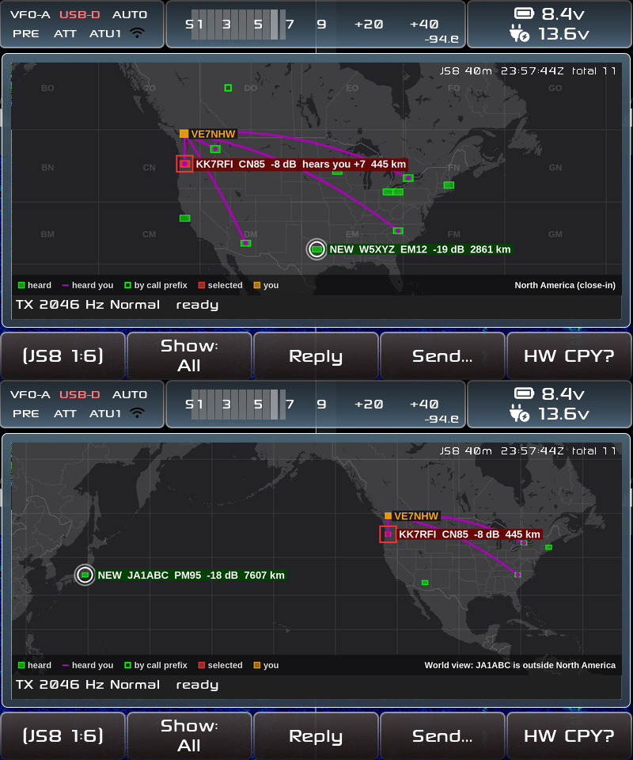
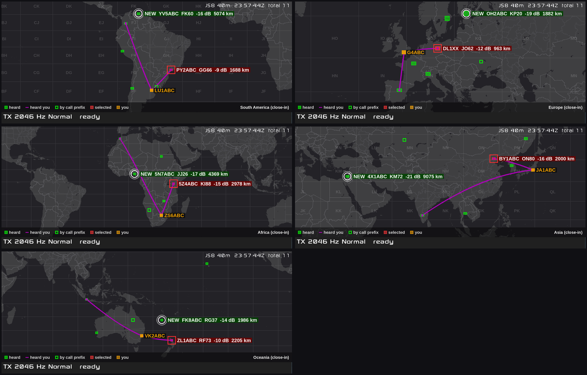

# Show Map: plan

A third view next to the message list and the Stations view: a world map
with the stations heard on this frequency in their grid squares, you at
yours, and curved paths to the stations that heard you. Inspired by
GridTracker 2's map ("just the map"). **Status:** phase 1 done (the
maths and callsign lookups, tested on the PC) and phase 2 done (the base
map drawn by the radio in 19–51 ms a view); phase 3 (the view in the
app) working in the test harness, not yet tried on the radio.

*Mock-ups on the radio's real screen (drawn on a PC with the same data and
colours the radio would use): North America close-in with the selected
station in red and a new station popping up, then the automatic switch to
the world view when JA1ABC is heard.*

## Decided (VE7NHW, 2026-09-29)

- **Full size:** the map takes the waterfall's and the list's place
  (771 x 324 px); the TX bar moves to its bottom edge, a small legend above
  it. The waterfall isn't needed in this view.
- **GridTracker's look:** Web Mercator (the stretched-near-the-poles shape),
  its Dark Gray colours (ocean `#232227`, land `#3f3f41`, lighter borders),
  stations as see-through filled 4-character grid squares.
- **Colours:** you orange `#FFA600` (GridTracker's QTH colour; a Setting),
  stations heard green `#00FF00`, the **selected station red**, paths
  **purple `#AB00B6`** (sampled from the reference video: Ham Radio Crash
  Course, "Make Your WSJT-X & GridTracker Look Awesome and Work Better!").
- **Paths:** curved great-circle lines from you to every station that heard
  you, with a dot at the far end, as GridTracker draws them.
- **No grid?** Place the station by its callsign prefix at the centre of
  its region (VE7/VA7 → British Columbia) or country; drawn hollow so it's
  clearly approximate.
- **Labels:** only the selected station (red box, call, grid, SNR, how they
  hear you, distance) and **new stations**: those pop up with the same
  information and a flashing ring for **8 s**, then only the square stays.
  Several new ones at once all pop up, placed so they don't overlap.
- **Two zooms, automatic:** a **close-in** view of your continent (every
  continent works: users are worldwide) and the **world** view. Your
  continent comes from your callsign. As long as every station shown is on
  your continent, the map is close-in; a station anywhere else switches it
  to the world view; when the last one ages off the list (Settings →
  *Stations kept*) it goes back. Each view zooms to fit the stations
  actually shown (never closer than about 40° x 18°), so the space is used
  well: a fixed whole-continent frame is far too zoomed out in Mercator
  (North America would have to include Alaska, Greenland and the
  Caribbean).
- **A button for the view:** *Map: Auto / Close-in / World* (Auto by
  default), shown only while the map is open, in the button slot Time Sync
  leaves free.
- **Time Sync moves to the Settings list** (buttons are running out):
  *Time Sync now* and *Reset time drift*; the status line keeps showing
  the drift.
- **No day/night line** ("too much stuff").

## How it works

### Buttons

| Where | Now | With the map |
|---|---|---|
| Page 3, 2nd | Time Sync | **Map: Auto / Close-in / World**, only while the map shows (blank otherwise) |
| Page 3, 4th | Show Stations / Messages | cycles **Messages → Stations → Map** |
| Page 2, 2nd | Show: No HB / Directed / All | in the map: **All heard / Heard me** |
| Settings list | — | *Time Sync now*, *Reset time drift*, *My map colour* |

The MFK steps through the stations on the map (the selection is shared with
the list and the Stations view: select on the map, Reply, Query ... work as
now). The main knob keeps moving the TX offset.

### Which stations

The Stations list of the current frequency, as the Stations view shows it
(same *Stations kept* ageing): grid, SNR, *heard me*, and the SNR they
report. A grid (4 or 6 characters) places the station in its square;
without one, the callsign prefix does. *New* = first heard on this band
since power-on (the rule the Stations view's "new station" alert already
uses). *Heard me* adds the path.

### Callsign → place

- **Country and continent:** AD1C's `cty.dat` (the file desktop JS8Call and
  WSJT-X ship; its **Big CTY** edition, vendored in `third-party/cty/`, MIT
  licence), parsed at start: prefixes, exact calls (they win: `KL7AB` is a
  real call listed as living in the lower 48), the entity's centre and
  continent, and cty.dat's own per-prefix positions when it has them.
- **Regions** where the call area says where: our own small table,
  `src/js8/prefix_regions` — Canada by province (VE1/VA1 NS, VE2 QC, VE3 ON,
  VE4 MB, VE5 SK, VE6 AB, VE7 BC, VE8 NT, VE9 NB, VO1 NL, VO2 Labrador, VY0
  NU, VY1 YT, VY2 PE), US call areas 0–9 and KL7/KH6, Australia VK1–VK8,
  Japan JA0–JA9, then more as needed. Only as good as call areas are (a US
  call no longer says where someone lives); it's the fallback, drawn hollow.
- **Portable calls:** `VE7NHW/W6`, `W6/VE7NHW`, `KG4UHM/6` → the prefix
  part decides (`/6` = call area 6), as desktop's logbook does.
- **Your own continent:** from your callsign the same way; if the prefix is
  unknown, from your grid.

### Drawing

- **Base map** from Natural Earth (public domain): land, lakes, country
  borders, state/province lines. A tool (`tools/map_data`, Python)
  simplifies them and stores them already projected (Mercator, integer
  coordinates), a few MB, installed on the radio's system partition (240 MB
  free in the current image).
- The radio **draws the base map itself** for whatever view the auto-fit
  picks (pre-drawn tiles only come in fixed zoom steps). It's redrawn only
  when the view changes, on a worker thread, into an image the screen
  shows. **To measure first:** how long that takes on the radio; the
  target is well under 200 ms (110m detail for the world view, 50m
  close-in).
- **Stations, paths and labels** are drawn over it only when something
  changes (at most once a second), not with every waterfall row.
- While the map shows, the waterfall isn't drawn (decoding goes on), so the
  map costs about what the waterfall saves.

### Settings

*My map colour* (orange to start; a few presets), *Time Sync now*,
*Reset time drift*.

## Phases

1. **Data and maths, on the PC with tests** (done): Maidenhead ↔ lat/long,
   Mercator, great-circle paths, fit-to-stations with the minimum area,
   the continent rule, `cty.dat` parsing and the region table (portable
   calls included). Unit tests in `tests/test_js8.cpp`.
   Code: `src/js8/geo.{hpp,cpp}` (locators — same centres as the radio's
   `qth_str_to_pos()`, so map positions and the Stations view's distances
   agree — distance, bearing, Mercator, great circles, the fitted view),
   `src/js8/callsign_place.{hpp,cpp}` (cty.dat, desktop's
   `effective_prefix()` and KG4 rule, call areas, the region table) and the
   C API the app will use, `src/js8/js8_map.h` (`js8_map_place()`,
   `js8_map_my_continent()`, `js8_map_choose_view()` with Auto /
   Close-in / World, `js8_map_project()`, `js8_map_grid_rect()`,
   `js8_map_path()`). Tests `[map]`: 7 cases, ~1200 checks. Parsing
   cty.dat and 20 lookups: 19 ms on the PC (debug + ASan build).
2. **Map data and the drawing test:** `tools/map_data`; draw the base map
   in C; time it on the PC, under ARM emulation, then on the radio.
   Done on the PC: `tools/map_data/make_map_data.py` → `js8_map.bin`
   (1.07 MB: 110m 5k land points, 50m 59k, plus lakes, borders, states);
   `src/js8/map_render.{hpp,cpp}` (even-odd fills with exact coverage
   across and 4 sub-rows down, 1 px anti-aliased lines, field lines, wrap
   copies across the date line, 50m from 3.5 px/degree); a **whole-world**
   view for the World button (latitudes -56 to +75 in one copy centred on
   your longitude, ocean either side — the screen is too low for the whole
   Mercator world); `js8_map_render_base()` in the C API; tests draw real
   views and check land, water, lakes and the date line.
   Times per view (771 x 268): PC 0.8–2.2 ms; the radio's ARM build under
   emulation 14–29 ms, pixel-identical to the PC's.
   **On the radio** (2026-09-29, VE7NHW's X6100, 4 x ARMv7, the GUI
   running): loading `js8_map.bin` 92 ms (once, when the map opens);
   per view North America close-in 31 ms, the fitted world 51 ms, the
   whole world 31 ms, Europe 41 ms, Oceania 19 ms, a local view 34 ms —
   well under the 200 ms target, and pixel-identical to the PC's output
   (md5). So the radio draws the base map itself for whatever view the
   fit picks; no pre-drawn tiles needed.
3. **The view in the app:** the third view, the buttons, Time Sync into
   Settings, selection shared with the list, the TX bar at the bottom, the
   waterfall paused while hidden. Harness scenario `ONLY_MAP` with
   screenshots (close-in, switch to world and back, a new station's 8 s
   pop-up, Heard me, the view button).
   Done in `src/dialog_js8.c` ("Show Map" section): the map is an opaque
   box with a canvas over the waterfall and the list; the Stations view
   stays underneath (`view_stations` and `view_map` both on), so the MFK
   selects there and the map draws that selection. `map_update()` picks the
   view (`js8_map_choose_view()`, fitted into the part above the legend and
   TX bar, then drawn over the whole area), redraws the base map only when
   the view moves (synchronous, 19–51 ms on the radio), and redraws the
   stations only when a hash of what's shown changes (checked every
   250 ms, so pop-ups flash at 2 Hz). Labels go right, left, above or
   below, never over another label, the legend, the status line, you or
   their own station; the selected station's and yours always show.
   `params.js8_map_mode` (Auto / Close-in / World) is saved. Data files
   install to `/usr/share/x6100/js8/` (top-level CMakeLists). Harness
   `ONLY_MAP` (see its README).
4. **Polish:** pop-up timing and placement, label overlaps, colours
   setting, README.
5. **On the air**, then a beta.

## Credits and licences

Natural Earth (public domain) for the map; AD1C's country file (`cty.dat`,
MIT licence per <https://www.country-files.com/copyright/>, shipped as
desktop JS8Call ships it); colours and ideas from GridTracker 2
(no GridTracker code, map tiles or data are used). The Esri *Dark Gray*
tiles GridTracker shows online can't be copied onto the radio; ours are
drawn from Natural Earth in the same colours.
